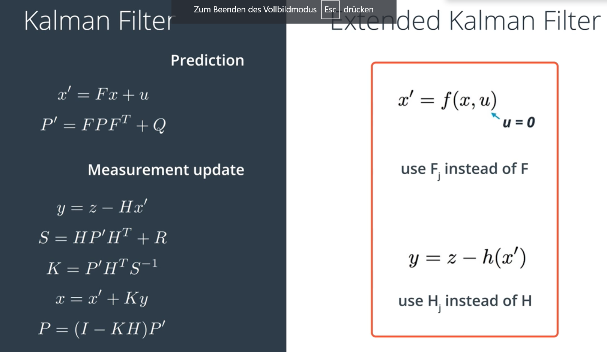
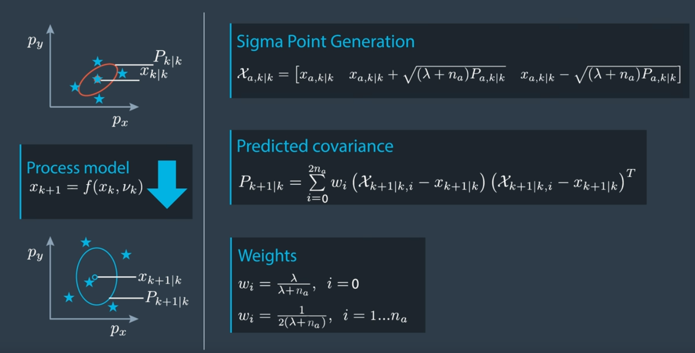
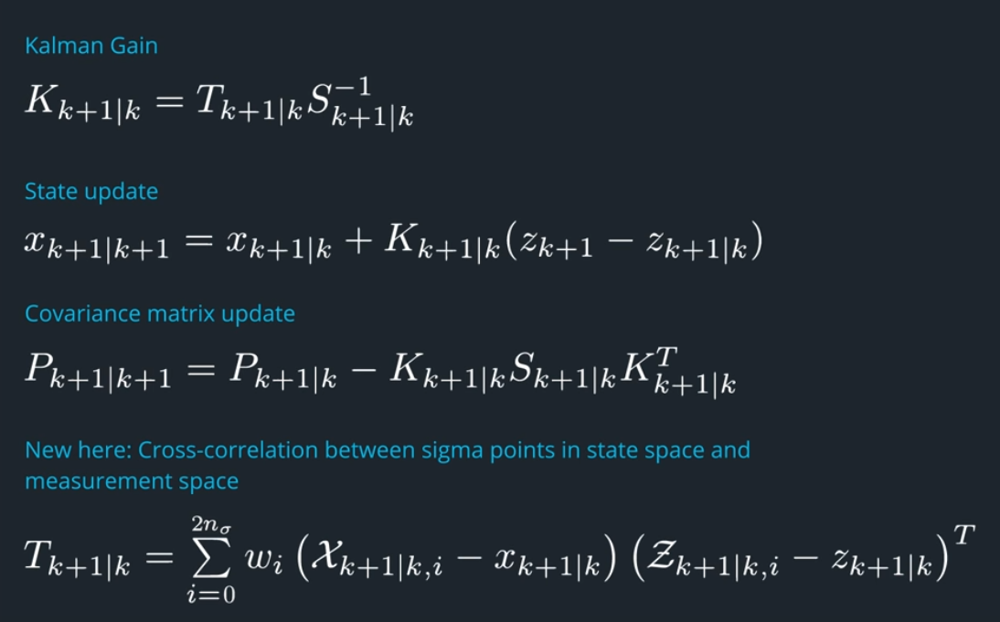

## Motion Model
constant turn rate and velocity magnitude model (CTRV)
constant turn rate and acceleration (CTRA)
constant steering angle and velocity (CSAV)
constant curvature and acceleration (CCA)

## Kalman Filter
连续性预测的单一模型，由两步组成：
- state predict: addition based on total probability,
$$ μ^{'} \propto μ+\nu$$
$$(σ^2)^{'} \propto σ^2 + r^2$$
- measurement update: production based on bayes rule，
组合权重由方差决定，update个数由sensor数决定。
$$ μ^{'} = \frac{r^2μ+σ^2\nu}{r^2+σ^2}$$
$$ (σ^2)^{'} = \frac{1}{\frac{1}{r^2}+\frac{1}{σ^2}}$$

### Design of KF

- state transition matrix F
- process covariance matrix Q (depends on the elapsed time and the uncertainty of acceleration)
- measurement matrix H
- measurement covariance matrix R (provided by sensor manufacturer)
- object covariance matrix P

## Extended Kalman Filter
用于处理测量的非线性问题（比如Radar），通过非线性函数的一次泰勒展开（Jacobian matrix）将状态空间转换到测量空间，同时保证高斯分布。
- Jacobian matrix of state transition matrix Fj
- Jacobian matrix of measurement matrix
- u is 0, uncertainty is placed in Q (u~N(0,$\sigma^2$))

## Unscented Kalman Filter
通过代表性数据点（sigma point）采样来处理高度非线性问题。
- 生成代表点
    - num of sigma points: $n_{\sigma}=2n_x+1$, $n_x$:状态向量的维度
    - sigma point matrix: $X_{k|k}=[x_{k|k}, x_{k|k}+\sqrt{(\lambda+n_x)P_{k|k}}, x_{k|k}-\sqrt{(\lambda+n_x)P_{k|k}}]$, $\lambda=3-n_x$
    - external motion noise vector
    $$v_k=\begin{bmatrix} v_{a,k} \\\ v_{\ddot{\psi},k} \end{bmatrix}$$
    - 利用augmented UKF处理process covariance matrix Q的非线性
- 预测状态
    - 预测sigma points

    - 预测均值和方差

- 更新状态

## Particle Filter
