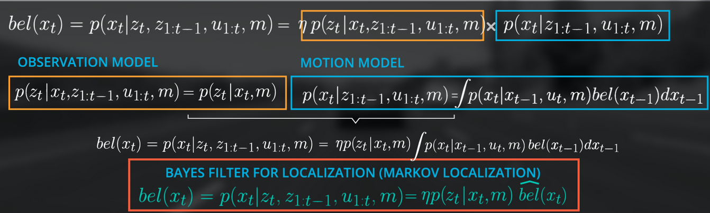
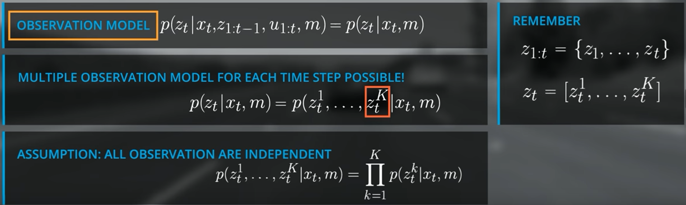
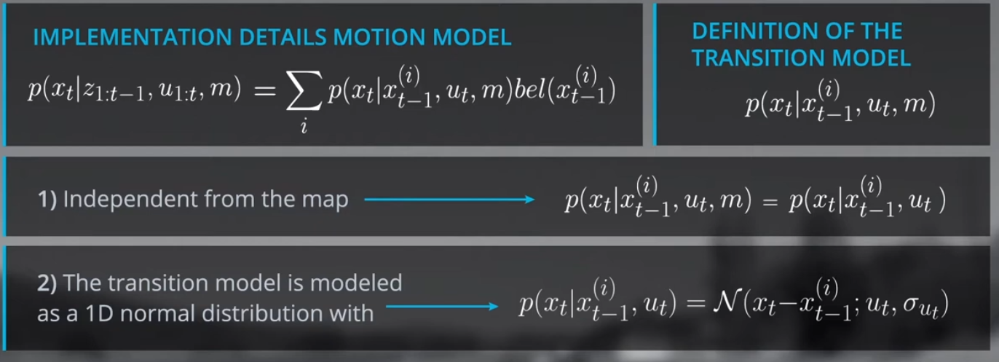

## location 
entropy will decrease after the measurement update (sense) step and that entropy will increase after the movement step (move).
- belief: initial probability
- sense: product p_hit and p_miss, followed by normalization (bayes rule)
- move: convolute over exact and inexact movement

## bayes filter (Markov Model)
- next state only depends on current state
- all observations are independent

### observation model（update step）

 there exists a variety of observation models due to different sensor, sensor specific noise behavior and performance, and map types. For our 1D example we assume that our sensor measures to the n closest objects in the driving direction, which represent the landmarks on our map. We also assume that observation noise can be modeled as a Gaussian with a standard deviation of 1 meter and that our sensor can measure in a range of 0 – 100 meters.
$$ p(z_t|x_{t}, z_{1:t-1}, u_{1:t},m) = p(z_t|x_{t}, m) $$ 

### motion model (prediction step)

$$ p(x_t|z_{t-1}, u_t,m) = \sum p(x_t|x_{t-1}^{(i)}, u_t)bel(x_{t-1}^{(i)}) $$
$$ u: control parameter (yaw, pitch, roll rates, velocity)$$ 
$$ m: map(grid maps, feature maps) $$
