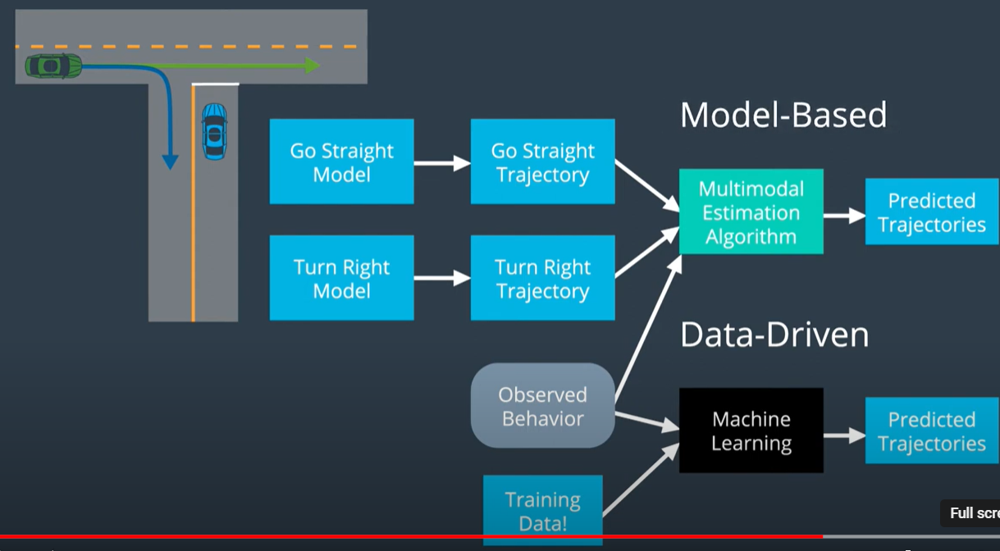
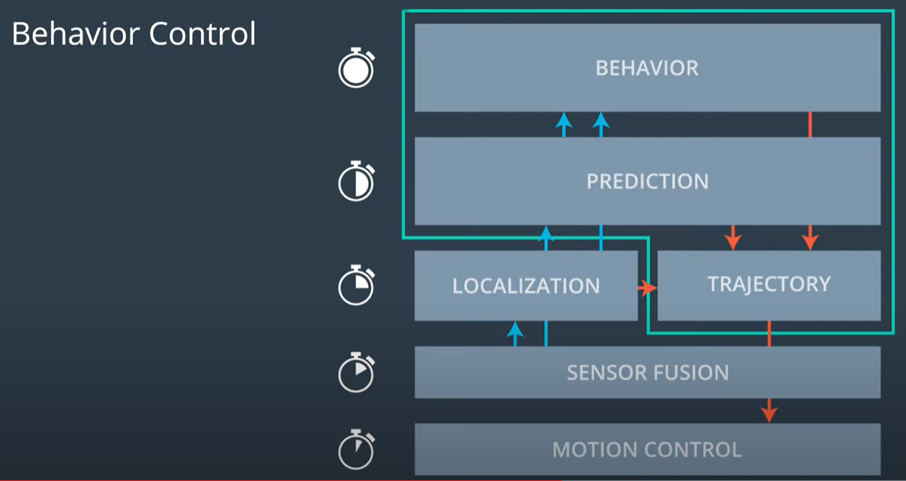
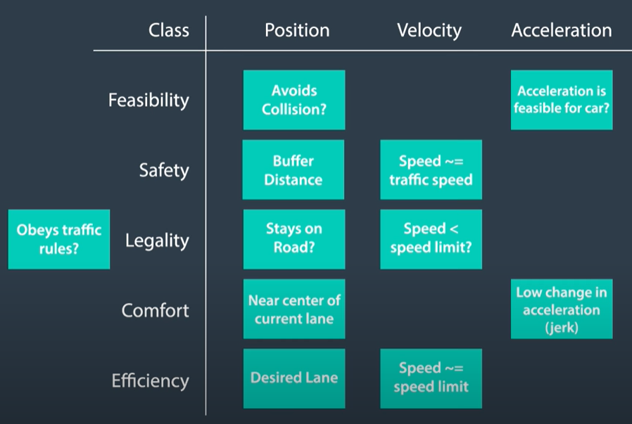

## Motion Planning
find a sequence of movements in configuration space (2d or 3d including heading) that moves the robot from start configuration q_start to goal configuration q_goal without hitting any obstacles given start configuration q_start (from localization and sensors) and goal configuration q_goal(from behavior) and constrains(physics, map and traffic). 
it usually use frenet coordinate(s-longitudinal position along the road, d-lateral position on the road) + time dimension t, the 3d problem is splitted into s-t and d-t problem.

properties:
- completeness: 
    - if a solution exists, planner always find a solution
    - if no solution exists, erminates and reports failure
- Optimality
    - given a cost function for evaluatirng a sequence of actions, planner always returns a feasible sequence of actions with minimal cost

methods:
- combinatorial methods
dividing free space into small spaces and solving motion planning problem by connecting these atomic elements. disadvantages: not scaling well for large environments

- potential field methods
treating robots as a particle moving in a field of force, and robots navigates by calculating the vector sum of teh attractive and repulsive forces at its current location and then moving in the direction of the resulting force. disadvantages: can get stuck in local minima (places where the forces cancel each other out)

- optimal control
finding a control for a dynamical system over a period of time such that an objective function is optimized. disadvantages: hard to incorporate alls constraints related to other vehicles in a good enough way in order to for algorithm to work fast.

- sample based methods
sampling state space of the system and building a graph that represents feasible transitions between the sampled states. two well known methods for path planning are Rapidly-exploring random tree (RRT) and probabilistic Roadmap Method(PRM).

### Route Planning
to find minimum cost path by expanding to next node in configuration space
#### discrete 
discretization of configuration and input space, methods are A*, D*, D*-lite, Dijkstra's, ARA*
1) classic A star search 
use heuristic function to estimate the cost to the goal and explores the path with lowest cost first.
- heuristic function is to estimate the cost to reach goal(no need to be accurate, as long as h(x,y) <= distance to goal from x,y), combination of heuristic functions need to underestimate the actual cost to the goal.
- open list holds position (x,y), g value and f value(cost value + heuristic value)

2) dynamic programming
key idea is to break down a complex problem into simpler subproblems, solve each of these subproblems just once and store their solutions. If same subproblem occurs, the previously calculated solution is used.

3) D star
it is extension of A star with dynamic edge costs. it solves path from the goal to the start(backward algorithm), it only update parts of the graph that are affected by the change in the environment.
- D Lite: it solves path from the start to the goal(forward algorithm)

#### continuous (focus on sample based)
random exploration of the configuration and input space. probabilistic graph search methods are RRt, RRT*, PRM.

1) hybrid A star 
while classic A star works on a grid and assums that vehicle can move in any direction at each grid point, the hybrid A star takes into account the vehicle's kinematics, i.e. the vehicle's physical constraints such as nonholonomic and minimum turing radius, and it memorizes the exact position of vehicle continuously. it is free-form planning suitable for unstructured environments (less specific rules and lower speeds, no obvious reference path), not for structured environments(predefined rules: direction of traffic, lane boundaries, speed limits; road structure can be used as a reference)

2) polynomial trajectory generation(PTG)
it is suitable for structured environments. it samples a large number of n configuration on the approximate desired position, and generate the jerk minimized trajectories for each goal configuration, then discard all nondrivable trajectories(collision with road boundary or with other vehicle from prediction). By ranking all remaining trajectories with cost function(lat/lon jerk, distance to obstacles, distance to center line, time to go) we can obtain the optimuum trajectory.
principals:
- continuity(position, speed)
- smoothness(jerk minimizing: coefficient of item higher than 6 should be 0) -> minimum 1d jerk trajectories: $s(t)=a_0+a_1*t+a_2*t^2+a_3*t^3+a_4*t^4+a_5*t^5$ (6 boundary conditions[start/end position velocity acceleration] will beused to solve the 5 degree polynominal[quintic polynominal]).
- feasibility: max/min velocity, max/min acceleration, steering angle.

3) RRT
it works by randomly exploring the search space and incrementally building a tree of paths. advantages are: ability to quickly explore large search space(suitable for real time application).
steps:
- start with a tree containing only the starting point
- select a random point in the search space and find closed node in the tree to this random point
- create a new node in the direction of the random point at a specified distance away. If the new node does not violate the constraints (for example, it does not collide with an obstacle), it is added to the tree. 
- repeated until the tree reaches the end point or a maximum number of nodes have been added.

RRT* is an extension of RRT, which refine the generated tree in roder to find a more optimal path.
it continually refines the tree as more points are added. 
- find existing nodes in tree that are nearby the new node
    - if the path is shorter to existing nodes through new node, then reassigns the parent of those nodes to the new node
    - if the path is shorter to new node through nearby existing node, then reassigns the parent of new node to the nearby node

4) PRM
PRM is sampled based method that constructs a roadmap in the configuration space, suitable for high-dimensional spaces.  it's particularly effective in environments where the free space is "loosely" connected. However, it can struggle in environments where the free space is "tightly" connected, such as narrow passages.
- sampling: randomly sampling a set of configuration and check if they are in free space
- local planner: connect each node to other nodes in the roadmap (eg. nearest neighbors) and check if path between two nodes is in free apace
- graph search: use graph search algo to find shortest path between start and goal nodes

### Prediction
it takes input from map of the world and sensor fusion data, generates state of the world of all vehicles and moving objects. it is represented by state of possible trajectories. Multi-object interaction can become much complexer during prediction.

#### Model based approach
use mathmatical model of motion to predict trajectory, which takes account of the physical capabilities of objects as well as the constraints of road and traffic laws etc. advantages are: incorporate knowledges of physics and constrains imposed by road, traffic laws.
process model (physical motion models: linear point model, nonlinear point model, kinemaic bicycle model with controller, dynamic bicycle model with controller) + multimodal estimator (handling uncertainty associated with prediction: autonomous multiple model[AMM]-use multiple models to represent different possible states of a system and switch between them autonomously based on incoming data).
steps: for each dynamic object nearby
- identify common driving behaviors(change lane, turn left, corss street etc)
- define process models
- update beliefs by comparing the observation with the output of teh process model.
- Probabilistically classifying driver intent by comparing the likelihoods of various behaviors with a multiple-model algorithm.
- Extrapolating process models to generate trajectories.

#### Data driven approach
use trained ML model to make prediction of trajectories based on observed behaviors, it contains offline training and online prediction. Advantages are: use data to extract patterns that may be missed by model based approaches. Disadvantages are: purely depend on historical data and is black box.
steps:
- collection and clean trajectories
- define measures of similarity
- perform unsupervised clustering (agglomerative clustering or spectral clustering)
- define prototype trajectories for each cluster

- observe vehicle's partial trajectory
- compare to prototype trajectory (same similaritiy used in clusering)
- predict trajectory in each timestep

#### hybrid approach
process models + ML classifier

- Intent classification
predict future actions of other agent on the road, such as CNN, RNN or LSTM

- naive bayes classificaiton

### Behavior Planning

takes input of map of the world, route to destination and predictions about other agents, produces suggested maneuver to ego-vehicle to guarantee road safety, feasibility, legality and efficiency. not included are execution details and collision avoidance.
Behavior planning module updates at a lower frequency than the trajectory planning module.

#### Finite State Machine
it makes prediction based on finite set of discrete states. suitable for high way driving.
- states
conditions that the machine can be in. if a state has no transition to other state, it is called accepting state.
(states: lane keep, lane change left, lane change right, prepare lane change left, prepare lane change right)
- tranitions
rules that indicate how the machine can move from one state to another. transition function use cost function to find the best trajectory for next accessible state.

advantages:
- easy to reason, as it maps logical state directly to physical state
- maintainable, as it is for small state space

disadvantages:
- easily abused , as new changes corrupt existing logics.

##### cost function

- solving new problems without "unsolving" old ones
    - regression test: define expected behavior under sets of situations; whenever changes are made, simulate these predefined test cases to check expected behaviors.
- balancing costs of drastically different magnitudes (solving safty issue without considering efficiency)
    - feasibility >> safety >> legality >> comfort >> efficiency
    - weights can change depending on situation
- reasoning about individual cost functions
    - specificity of cost function responsibility
    - binary (if breaking traffic rules) vs discrete (following traffic speed) vs continuous (bing to target speed) cost function
    - all cost functions output between -1 and 1
    - parametrizaiton when possible
    - thinking in terms of vehicle state (position, speed, acceleration)

