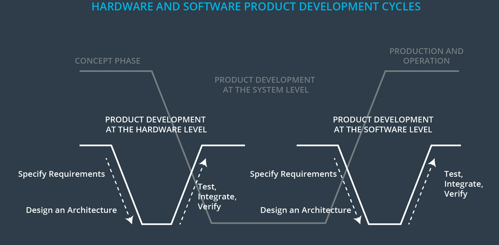

## Functional Safety

functional safety and ISO 26262 do not consider all risk in E/E systems. They only consider reducing risk as a result of malfunctioning behavior of E/E systems(no other safety and normal performance are considered in FUSA, normal performace is related to SOTIF in  ISO 21448). Functional safety focuses on keeping risks below society's current threshold. ISO 26262 compliance is not legally required, but a standard way to ensure a safe EE system.

- identify hazards
Take a machine learning algorithm as an example. What happens if a pedestrian training set does not include pedestrians in wheelchairs? The system would not count a pedestrian in a wheelchair. How accurate do our results need to be on a validation set? Who determines what the training set needs to contain?
- evaluate the risk
Automotive Safety Integrity Level. ASIL is a four point scale of ASIL A, ASIL B, ASIL C and ASIL D. And one more level of risk below ASIL A called QM.
- using systems engineering to lower risk

## requirements
- Functional requirements generally have the form X system shall do Y. For example, "The turn signal system shall turn on an indicator light telling the driver that the system is active".

- Non-functional requirements have the form X system shall be Y. As an example: "The turn signal system shall be available when the vehicle ignition switch is in the on position".

## ASPICE

### V Model
ASPICE是为了规范我们代码开发流程，同时提高我们的代码质量,严格做到在开发前有明确的开发方案，明确的开发流程，任何代码的设计都有靠谱的依据来源，是我们代码质量的保证。我们通过这个文档以及测试结果来进行验收，来判断设计，开发是否符合客户的需求，是否满足于最初的项目目标。

严格按照标准的ASPICE来进行项目开发，我们需要从上至下按照V模型进行。即：先完成系统需求，系统架构设计，再完成软件需求，软件架构，软件详细设计，最后才是代码开发和测试，而现实中的很多项目因为时间关系代码开发和文档编写都是并行，这是不符合ASPICE的要求的，并没有很好的发挥ASPICE的优点来把控我们的代码质量。
充分使用，合理安排，在满足客户的需求下，对文档的要求进行适当的裁剪，在此条件之前，按时按质的完成项目目标。裁剪仅仅是为了将有限的时间安排在重要的事项中。针对生命周期长的项目，可严格遵循；针对生命周期短且任务重的项目，可做适当的裁剪 ，裁剪掉相对不重要的过程以及流程，或者做并行处理。当然根据实际情况实际评估。
### Tracibility and Consistency

### 
