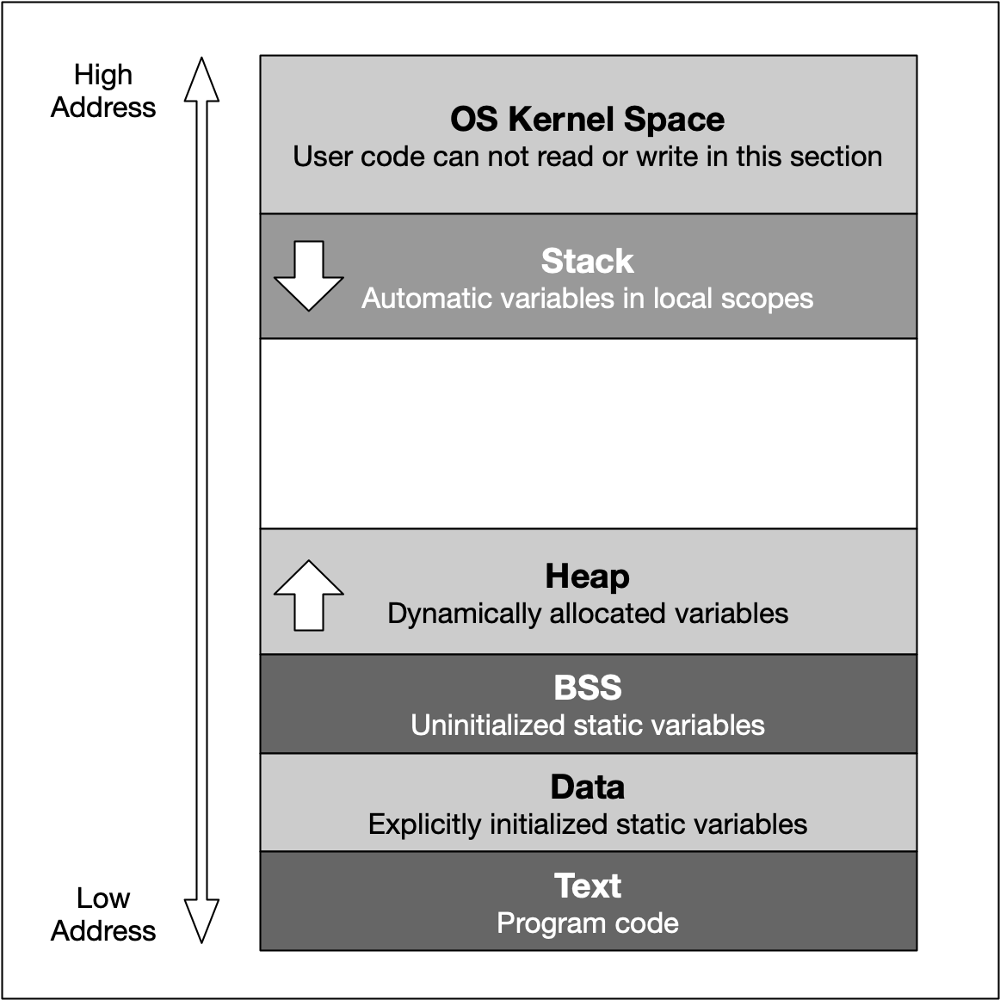

## cpp性质
### 多态
1. 静态多态
- 函数重载
- 模板函数和模板类（vector就是一个模板类），c++17可以很好的自动进行类型推断。
2. 动态多态
主要通过虚函数（Virtual Functions）和继承来实现。基类的指针或引用可以指向派生类的对象，当通过基类的指针或引用调用虚函数时，会根据指针或引用的动态类型（即运行时的实际类型）来决定调用哪个函数。
override关键字用于显式地告诉编译器，派生类中的函数意图覆盖基类中的同名虚函数。如果派生类中的函数并没有正确地覆盖基类中的虚函数（例如，函数签名不匹配），编译器将会发出错误。

## 关键字
### const
- 声明常量，运行时不可以改变
- 限定函数参数在函数内不能被改变
- 限定成员函数(如getter func)：#void myFunc() const
    - 常成员函数不能修改类的任何成员变量（除非他们被声明为mutable，如mutable int myVariable）
    - 常成员函数不能调用非常成员函数；
    - 常对象只能调用其类的常成员函数，不能调用非常成员函数
- 限定成员变量
    必须在声明时或在构造函数的**初始化列表**中进行初始化
- 限定指针：
    - 指向常量的指针：const int* ptr
    指针的值可以被修改，但是指向对象的值不能被修改
    - 常指针：int* const ptr
    必须进行初始化，指针的值（它指向的地址）不能被修改，指向对象的值可以被修改。
- 限定实例化对象
    默认为文件局部变量，需用extern 显式修饰才能在文件外访问。

在C中用const不能定义真正意义上的常量，c中的const仅仅是从编译层来限定，不允许对const 变量进行赋值操作，在运行期是无效的（通过指针对const变量是可以修改值的），c++在编译时会把const常量加入符号表，遇到这个变量会从符号表中查找，所以在C++中是不可能修改到const变量的。

### static
- 静态局部变量
    函数内部声明的静态变量，只在函数内部可见，生命周期是整个程序执行期。但是函数调用不会被重新初始化
- 静态类成员变量
    在类中声明的静态变量由所有对象共享，只能在类外初始化
- 静态类成员函数
    它没有this指针，因此只能访问静态成员变量和静态成员函数，不能访问非静态变量和函数；可以直接通过类名和范围解析运算符调用，不需要创建类的对象；它不依赖于类的对象且不能修改类的成员变量，因此不能被const或volatile修饰（const或volatile成员函数需要this指向所操作的对象）。
- 静态全局变量和函数
    只在声明它们的文件中可见

### volatile
一种类型修饰符，使用 volatile 告诉编译器不应对这样的对象进行优化。每次访问时都必须从内存中取出值（没有被 volatile 修饰的变量，可能由于编译器的优化，从 CPU 寄存器中取值）。但它并不能保证多线程安全，需要使用互斥锁等同步机制。
- 当const和volatile同时修饰一个变量表示这个变量是只读的并且不应对它进行优化(如只读的状态寄存器)
- 指针可以是volatile(如中断服务子程序修改一个指向一个buffer的指针)

### explicit
- 防止构造函数隐式类型转换;
- 防止转换函数隐式类型转换

### friend
声明友元函数或友元类，可以访问类的私有或保护成员。
- 友元函数通过对象来访问该类的私有或保护成员（常用于组合类中）。
- 友元类的声明在该类的声明中，而实现在该类外。
优点：提高了程序的运行效率。
缺点：破坏了类的封装性和数据的透明性。
特点：
- 友元关系没有继承性 假如类B是类A的友元，类C继承于类A，那么友元类B是没办法直接访问类C的私有或保护成员。
- 友元关系没有传递性 假如类B是类A的友元，类C是类B的友元，那么友元类C是没办法直接访问类A的私有或保护成员。

### using
- 导入命名空间
- 改变基类中成员函数和成员变量的访问权限
- 将基类函数重载到派生类
- 定义类型别名

### decltype
用于检查实体的声明类型或表达式的类型
- 泛型编程(template)中结合auto，指定函数的返回值类型
- 使用decltype获取匿名结构体的类型
- decltype（e），
    - e是一个被重载的函数会导致编译错误
    - 如果e是一个将亡值。推导为类型的右值引用
    - 如果e是一个左值。推导为类型的引用
    - 以上都不是，则推导为本类型

### inline
- 避免函数调用开销，不需要跳转到被调用函数的地址去执行，直接在当前代码段执行。内联是以代码膨胀(复制)为代价。
- 虚函数通常不能内联，因为内联函数需要在编译时知道函数的实现。虚函数可以是内联函数，内联是可以修饰虚函数的，但是当虚函数表现多态性的时候不能内联。

### virtual
虚函数是实现运行时多态的一种机制：父类中虚函数为子类提供默认的函数实现，子类可以重写父类的虚函数实现子类的特殊化。
- 虚函数是为了允许用基类的指针来调用子类的这个函数。
- 纯虚函数是为了实现一个接口，起到一个规范的作用，规范继承这个类的程序员必须实现这个函数。含有纯虚函数的类为抽象类，无法实例化（virtual void talk() const = 0）

虚函数表（Virutal Function Table，vtbl）和虚函数指针（Virutal Function Pointer，vtpr）是实现运行时多态的关键。虚函数表是存储类虚函数地址的数组，每个类的对象都有一个虚函数指针指向虚函数表。
- 虚函数不能是静态函数
虚函数依靠vptr和vtable来处理。静态成员函数没有this指针，无法访问vptr。
- 构造函数不可以声明为虚函数。同时除了inline|explicit之外，构造函数不允许使用其它任何关键字。vptr是在运行阶段实例化对象时才产生的。如果构造函数是虚的，那么它需要vptr来访问vtable，可这个时候vptr还没产生。
- 析构函数可以声明为虚函数。当类被用作基类时， 就应该声明虚析构函数(否则删除派生类对象时，只调用基类的析构函数，导致资源泄露)。
- 虚函数不可以为私有函数，因为vptr无法访问私有函数

## 宏
### assert
断言主要用于检查逻辑上不可能的情况。例如，它们可用于检查代码在开始运行之前所期望的状态，或者在运行完成后检查状态。
- 断言通常在运行时被禁用。在代码开头加上#define NDEBUG

### 字符串操作符# 
在一个宏中的参数前面使用一个#,预处理器会把这个参数转换为一个字符数组。
- 忽略传入参数名前面和后面的空格
- 当传入参数名间存在空格时，编译器将会自动连接各个子字符串，用每个子字符串之间以一个空格连接，忽略剩余空格。
### 符号连接操作符（##）
“##”是一种分隔连接方式，它的作用是先分隔然后进行强制连接。将宏定义的多个形参转换成一个实际参数名。
- 当用##连接形参时，##前后的空格可有可无。
- 连接后的实际参数名，必须为实际存在的参数名或是编译器已知的宏定义。
- 如果##后的参数本身也是一个宏的话，##会阻止这个宏的展开。
### 续行操作符（\）
当定义的宏不能用一行表达完整时，可以用”\”表示下一行继续此宏的定义。

## 数据结构
### 位字段Bit field 
特殊数据结构，把数据以位的形式紧凑的储存，并允许程序员对此结构的位进行操作，节省存储空间。
通过在结构体中声明一个特殊类型的成员变量来定义，变量类型必须为整数类型。

### union
在相同的内存位置存储不同的数据类型，大小等于其最大成员的大小。

- 默认访问控制符为 public
- 可以含有构造函数、析构函数
- 不能含有引用类型的成员（引用类型没有自己的独立存储空间）
- 不能继承自其他类，不能作为基类
- 不能含有虚函数
- 匿名union在定义所在作用域可直接访问union成员
- 匿名union不能包含protected成员或private成员
- 全局匿名union必须是静态（static）或全局的

### enum
"unscoped" enum的成员在父作用域中可以直接使用，支持隐式转换维其他类型;
c++11中 scoped enum class的作用域是局部的（传统的enum是全局的）；不能隐式转换成其他类型。枚举常量不会占用对象的存储空间，它们在编译时被全部求值。
缺点：
- 隐含数据类型是整数，其最大值有限，且不能表示浮点。

### 结构体struct
如果数据成员独立变化选用struct, 如果数据成员有不变性规律选用class。
- C++结构体中不仅可以定义数据，还可以定义函数。
- C++结构体中可以使用访问修饰符，如：public、protected、private 。
- C++结构体可以直接使用不带struct,如果结构体名和变量名不冲突。
- 结构体的名字可以与函数名相同，因为他们存在于不同的命名空间(只适用于带struct定义的结构体,不适用typedef定义结构体别名)
- C++结构体可以继承（struct默认继承为public, class 默认继承为private）
- 默认的访问权限(struct是public的，class是private的)

### 引用与指针
引用是对已存在变量的别名（引用作为形参不存在复制操作，既可以返回多值，也可以提高效率）；指针是一个存储了另一个变量地址的变量(复制变量地址)。
引用相比于指针更加安全，因此更推荐使用。指针却更加灵活，可以更改指向对象。
- 引用必须初始化，而指针可以不初始化。
- 引用不能为空，而指针可以为空。
- 引用不能更换目标,而指针可以
- 非内部数据类型的引用作为形参可以提高函数效率。

对于基本数据类型（如int，double等），通常不建议使用引用。这是因为：
- 基本数据类型的大小通常很小，直接传递值的开销并不大。而引用实际上是通过指针来实现的，所以使用引用可能会增加额外的解引用操作，这可能会导致更大的开销。
- 使用引用可能会导致意外的副作用。如果函数修改了引用的值，那么原始变量的值也会被修改。这可能会导致难以预见的结果，特别是在大型项目中

指针的大小是固定的(取决于系统和编译器)，对基本的数据类型，指针传递并不一定高效。

指针参数传递和引用参数传递：
- 指针传递只能改变所指对象的值，不能改变指针本身
- 引用传递既可以改变对象内容，也可以改变指针本身

&/*
&位于等式左侧表示声明引用变量；&位于等式右侧表示取地址符
*位于等式左侧表示声明指针变量；*位于等式右侧或已定义变量前表示取值符号

### 移动语义
- 左值：左值（lvalue）是指可以在内存中被定位的值。它有一个明确的内存地址，通常代表一个存储位置，可以在赋值运算符的左边或右边。
可以取地址的，有名字的，非临时的
- 右值：右值（rvalue）是一个临时的、非持久的值，通常用于初始化左值（lvalue）。它不代表内存中的一个明确位置，因此不能被取地址。
不能取地址的，没有名字的，临时的
    - 纯右值(pure rvalue,pralue) 
        - 本身就是赤裸裸的、纯粹的字面值，如3、false；
        - 求值结果相当于字面值或是一个不具名的临时对象。
    - 将亡值(expiring value,xvalue)
        - 返回右值引用的函数的调用表达式
        - 转换为右值引用的转换函数的调用表达式

左值引用和右值引用
- 左值引用
    - 要求右边的值必须能够取地址，如果无法取地址，可以用常引用
- 右值引用：：作用是避免过多的拷贝，提高cpp效率；所有权转移
    - 用来绑定右值，绑定右值以后本来会被销毁的右值的生存期会延长至与绑定到它的右值引用的生存期。
    - 右值引用不能操作左值(利用std::move除外)
优点：
    + 消除两个对象交互时不必要的对象拷贝。
    + 能够更简洁明确地定义泛型函数，实现完美转发。

std::move可以将左值转换为右值，从而避免复制操作。
### 智能指针
- std::unique_ptr
独占所有权的智能指针，同一时间只能有一个unique_ptr指向给定对象。
- std::shared_ptr
共享所有权的智能指针
- std::weak_ptr
不拥有所有权的智能指针，与shared_ptr共同使用，防止shared_ptr之间循环引用

RAII(Resource Acquisition is Initialization): 将资源的生命周期与对象的生命周期绑定在一起。这意味着当对象被创建时，它会获取（acquire）必要的资源，当对象被销毁时，它会释放（release）这些资源。
- 使用构造函数来获取资源
- 使用析构函数来释放资源的类
- RAII对象会被分配到stack上统一管理
raw pointers: 直接存储了对象在内存中的地址的指针


### STL vector
是一种动态数组，遵循rules of five, 可以再运行时增长和缩小，允许快速随机访问，并且可以在尾部进行高效插入和删除。
采用成倍方式扩容可以保证常数的时间复杂度，而增加指定大小的容量只能达到O(n)的时间复杂度，因此，使用成倍的方式扩容。
vector内存空间是在vector对象被销毁（离开其作用域或者被delete动态销毁）或者调用clear+shrink_to_fit时才被释放。
- empty()用来检测容器是否为空的
- clear()可以清空所有元素(内存不释放)
- swap()可以将所有元素清空并释放内存。

### list、queue、deque、vector区别
- std::list是双向链表（存储空间不连续），允许在任何位置进行高效的插入和删除操作，不支持快速随机访问；插入操作和结合操作不会使list迭代器失效;
- std::deque是序列容器（双端队列），允许在两端进行高效的插入和删除操作，支持随机访问，动态地以分段连续空间组合而成，随时可以增加一段新的空间并链接起来
- std::queue是容器适配器，提供了FIFO的数据结构，不支持随机访问。底层是由std::deque或std::list实现
- std::vector是动态数组，允许快速随机访问，可以在尾部进行高效的插入和删除，动态扩容需要复制整个数组。

## 内存管理
访问时间和空间上临近的内存地址更高效（利用了cache）。
虚拟内存主要用于提供大量的、连续的地址空间，而缓存主要用于提高数据访问速度。
Valgrind可以自动检查内存泄漏。

### 内存类型
堆(heap)、栈(stack)、程序代码区、全局/静态存储区和常量存储区。
- 全局/静态变量会初始化为缺省值，而堆和栈上的变量是随机的。
- 全局/静态变量在程序启动时被分配，在程序运行期间一直存在
- 堆存放程序运行时动态分配的对象,在编译时大小必须已知
- 栈用来保存定义在函数内的非static对象(如局部变量)，仅在其定义的程序块运行时才存在

堆和栈的区别：
- 堆大小比较大，内存地址不连续；栈的大小通常比较小，通常只有几MB，是内存地址连续，申请和释放内存比较快
- 堆内存大小在运行时确定；栈大小在编译时确定
- 堆声明周期由程序员管理，动态分配；栈生命周期由编译器自动管理，自动分配和释放
- 堆从低地址向高地址增长；栈从高地址向低地址增长
- 堆在多线程中共享内存；栈在多线程中是独立不共享的(线程安全)

堆和自由存储的区别：
- 堆提供了低级的动态分配的功能，调用malloc/free分配和释放内存。
- 自由存储是通过new/delete动态分配和释放对象。

new/delete和malloc/free的区别
malloc申请的存储空间不能用delete释放, malloc/free不能执行构造函数与析构函数，所以不支持动态对象。

- new/delete是C++操作符关键字，需要编译器支持，**会调用对象的构造和析构函数**。malloc/free是库函数，需要头文件支持，无法强制要求其做自定义类型对象构造和析构工作
- new**符合类型安全性**，malloc内存分配成功则是返回void * ，需要通过强制类型转换将void*指针转换成需要的类型。
- new/delete可以实现**重载**来完成其他操作(处理其他参数，回收垃圾，异常处理)；malloc/free不能
- 使用new操作符申请内存分配时无须指定内存块的大小，编译器会根据类型信息自行计算。而malloc则需要显式地指出所需内存的尺寸。
- new内存分配失败时，会抛出bac_alloc异常。malloc分配内存失败时返回NULL。

"placement new"是C++中的一个特殊版本的new操作符，允许在已经分配的内存上构造一个对象，通常只在需要精细控制内存使用的情况下使用。
```
new (pointer) Type (initializers);
```

动态申请array of objects需要new[]和delete[], 但是占用的内存大于array_size*object_size(编译器记录分配的内存大小)
### 野指针
野指针：指向内存被释放的内存或者没有访问权限的内存的指针(造成segmentation fault)。
避免野指针
- 将指针初始化为NULL
char * p = NULL;
- 用malloc分配内存
char * p = (char * )malloc(sizeof(char));
- 用已有合法的可访问的内存地址对指针初始化
char num[30] = {0};
char *p = num;
- 指针用完后释放内存，将指针赋NULL。
delete(p);
p = NULL;

## 编译
### extern "C"
告诉编译器寻找C的语言符号

### ::
- 全局作用域符（::name）：用于类型名称（类、类成员、成员函数、变量等）前，表示作用域为全局命名空间
- 类作用域符（class::name）：用于表示指定类型的作用域范围是具体某个类的
- 命名空间作用域符（namespace::name）:用于表示指定类型的作用域范围是具体某个命名空间的

### ifndef/define/endif和 program once 的区别
相同点:
- 它们的作用是防止头文件被重复包含。
不同点:
- ifndef 由语言本身提供支持，但是 program once 一般由编译器提供支持
- 通常运行速度上 ifndef 一般慢于 program once

### do{...}while(0)
- 可以避免空宏警告
- 创建局部作用域，保证宏正确扩展
- 避免使用goto控制流（do while + break实现跳转）

### 动态库和静态库
- 静态库链接的时候把库直接加载到程序中，静态库在程序编译时会被连接到目标代码中，程序运行时将不再需要该静态库
- 动态库链接的时候，它只是保留接口，将动态库与程序代码独立，这样就可以提高代码的可复用度和降低程序的耦合度


