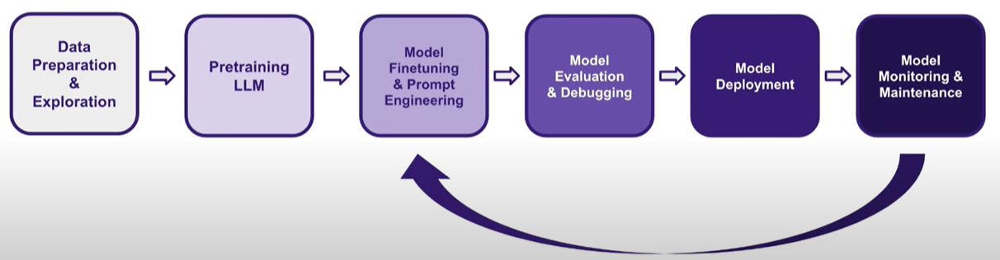

## LLM
- chatbot / personal assistants
- information extraction
- legel document analysis

### Prompt Engineering

1) basic techniques
- Specificity and Clarity: Avoid ambiguous instructions. Be explicit in your prompts to ensure precise and relevant outputs.
- Using Delimiters: Delimiters help structure and clarify prompts, especially when dealing with multiple information sections.
- Specify Output Format: Explicitly state the desired format of the output, whether it's free text, markdown, HTML, or a structured format like JSON.
- Prompt Chaining: Breaking down a task into subtasks (prompt chaining) can significantly improve the quality and accuracy of the outputs.
- Think Step-by-Step: Instructing the model to reason step-by-step through a problem can enhance the performance, especially in tasks involving complex reasoning.
- Role-Playing: Implementing role-playing in prompts, where the model assumes a specific role like a research assistant, can improve the quality and relevance of responses.

2) advanced techniques
1. Few-Shot In-Context Learning:
This approach involves feeding the model high-quality examples to steer its responses more effectively. For instance, to train a model to classify text as offensive or non-offensive, diverse examples of both categories are provided. This diversity, including failure cases, enhances the model's ability to accurately interpret and respond to similar tasks.

Example: A piece of text, "I respectfully disagree with your opinion," is presented to the model. By previously providing few-shot examples, the model is more adept at correctly classifying this as non-offensive, demonstrating the effectiveness of this method.

2. Chain of Thought (CoT):

The CoT technique guides the model through a series of logical steps, improving its ability to handle complex tasks that require deeper analysis. This is particularly useful for tasks that involve multiple reasoning stages.

Example: In a movie recommendation scenario, the model is instructed step-by-step to analyze various movie attributes and user requests. This structured approach allows the model to provide a well-reasoned and accurate recommendation.

3. ReAct Framework:

ReAct combines LLMs with external tools, enhancing performance and reducing hallucinations—a common challenge with current models. This method allows the model to access and integrate external information for more accurate responses.

Example: To determine the winner of the 2023 NBA finals, React leverages a search engine to supplement the model's knowledge, demonstrating its capability to provide accurate, up-to-date information.

4. Retrieval-Augmented Generation (RAG):

RAG enhances prompts with contextually relevant information extracted from external databases or knowledge bases. This technique significantly improves the model's reliability by grounding its responses in specific, task-relevant data.

Example: In querying about a course, RAG utilizes text chunks and embeddings stored in vector storage to provide a detailed and accurate description of the course content.

5. Prompt Chaining:

Prompt chaining involves breaking down a complex task into smaller subtasks, each addressed through a separate prompt. This method is particularly effective in processing and synthesizing large amounts of information.

Example: After analyzing movie recommendations, a second prompt is used to extract and present a concise user response, demonstrating the model's ability to handle detailed, multi-step processes.

3) logging, tracking, debugging

4) fine tuning
Step 1: Select a Base Model

The first step in fine-tuning LLMs involves choosing a suitable base model. Open-source platforms like Hugging Face's Hub offer a variety of models to start with. The choice of the base model should align with your specific requirements and interests.

Step 2: Prepare Your Dataset

Your fine-tuning dataset needs to be formatted appropriately. This dataset is crucial as it will directly influence the model's learning and adaptability to the task at hand.

Step 3: Fine-Tune the Model

Utilizing libraries like Transformers, you can fine-tune your chosen model. Fine-tuning LLMs can involve various techniques, such as reinforcement learning from human feedback, instructional tuning, and self-supervised learning. It's important to choose the most effective methods based on your specific use case.

Step 4: Evaluate and Debug

A critical part of the process is the evaluation and debugging of the fine-tuned model. This step ensures the model's quality and performance improvements. Remember, fine-tuning is an iterative process; hence, using tools like Comet is vital for tracking and optimizing model performance over time.

## LLMOps

1. Model and data versioning. As LLMs become larger, their systems grow more complex, and the iteration process slows down. This complexity necessitates robust model and data versioning solutions. Proper versioning allows for more efficient work, enabling developers to track changes and revert to previous versions if necessary. This aspect is particularly vital in maintaining the quality and consistency of the model as it scales.
2. Resource utilization and monitoring. Efficient use of resources is critical when working with large-scale systems. Implementing a comprehensive monitoring solution is an integral part of this process. Such solutions should provide insights into usage, latency, and other key performance indicators.
3. Distributed training. As models grow, developers might need to resort to distributed training, adding another layer of complexity. This approach requires careful management of hardware, such as GPU clusters, and the ability to consolidate diverse information, from data performance to system metrics. A robust LLMOps solution is vital in this context.

### Adversarial Prompting

1. Using Delimiters: Encapsulating user inputs within delimiters can prevent prompt injections.
2. Adding Defensive Prompts: Including prompts that instruct the model to adhere to original instructions despite adversarial attempts.
3. Leveraging Advanced Models: Newer models, like GPT 3.5 Turbo, exhibit greater resilience against prompt injections.
4. Structured Prompting: Separating system messages, user inputs, and user messages can provide a clearer structure for the model, reducing the risk of attacks.

