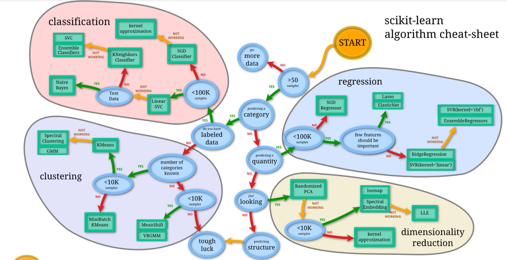
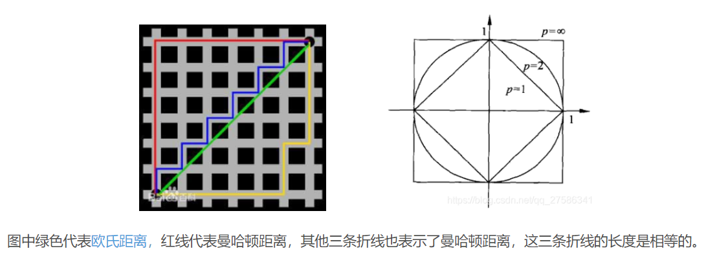
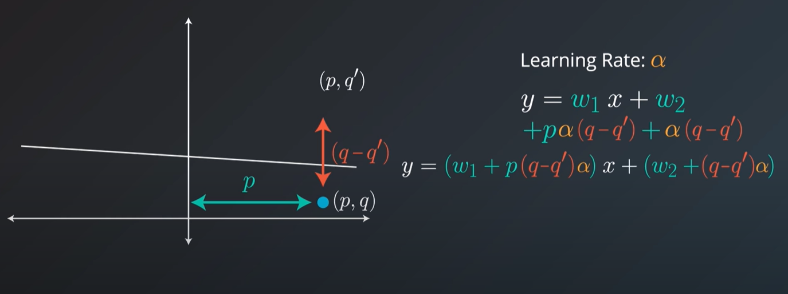
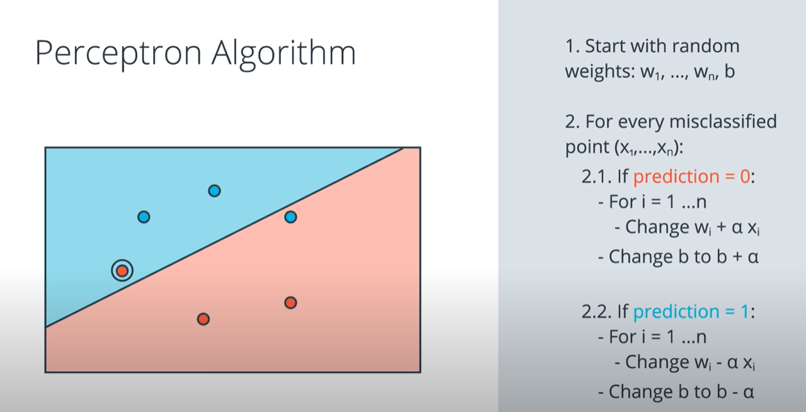
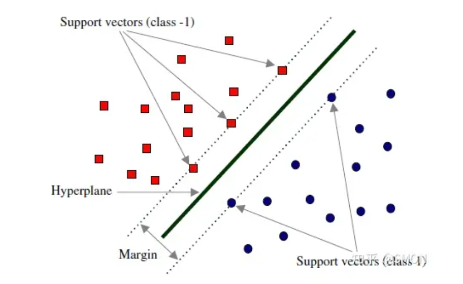

## 朴素贝叶斯模型
朴素贝叶斯假设所有的属性都是互相独立不相关的。朴素贝叶斯将实例分到后验概率最大的类中。后验概率最大化这等价于期望风险最小化。是线性模型分类器（可以表示为特征值的加权线性组合，在高维样本空间中找到一组超平面，将样本空间划分了两个区域）。

$P(Y|f_1,f_2,...,f_n ) = P(Y|f_1)*P(Y|f_2)...P(Y|f_n)$

$P(Y|f_i) = \frac{P(f_i|Y)*P(Y)}{P(f_i)} $

计算过程：

- 计算先验概率和条件概率
- 计算联合概率
- 通过最大化后验概率确定类别

贝叶斯网络

  贝叶斯网络借助**有向无环图**来刻画属性之间的依赖关系，并使用**条件概率表**来描述属性的联合概率分布。
- 利用贪心法，从某个网络结构出发，每次调整一条边，直到评分函数值不再降低
- 给网络结构施加约束条件：如限定为树形结构等
## KNN
用于特征与目标类之间的关系为比较复杂的类型，或者说二者关系难以理解。k一般采用交叉验证确定。knn是一种懒惰学习算法，没有损失函数。

- 根据给定的距离度量，在训练集 $T$ 中找出与 $x$ 最邻近的 $k$个点，涵盖这 $k$ 个点的邻域记作 $N_k(x)$；
- 根据多数表决决定x的类别

常用的距离度量(闵式距离)：$L_p(x_i, x_j) = (\sum_{l=1}^n |x_i^{(l)}-x_j^{(l)}|^p)^{\frac{1}{p}}$
- 曼哈顿距离（p=1）：适用于计算类似街区距离这样的实际问题。异常值对分类结果影响比欧式距离小。量纲不同时使用曼哈顿距离比欧式距离好。
- 欧式距离（p=2）：适用于向量各分量的度量标准统一的情况。在高维空间任意两个样本的最大距离和最小距离趋于相等，距离度量失效。
- 切比雪夫距离（$p = \infty$）：各个坐标维度距离数值差的绝对值的最大值

- 马氏距离：解决维度分布差异/量纲不同(different variances)的问题, 描述点到聚类的距离而不是点到点的距离。如果两个样本是独立同分布，马氏距离就变成了欧氏距离。
$$ D^2=(x-m)^T*C^{-1}*(x-m)$$
二维情况下简化为:
$$ d(x, c) = \sqrt{\frac{(x_1-c_1)^2}{\sigma_1^2} + \frac{(x_2-c_2)^2}{\sigma_2^2}}$$
$$ C: 协方差矩阵 $$
- 汉明距离：两个等长字符串之间的汉明距离是两个字符串对应位置的不同字符的个数
- 相关系数：相关系数的绝对值越接近1，表示样本越相似；越接近0，表示样本越不相似。
- 余弦相似度：强调方向上的相对误差，不满足三角不等式，因此它并不是严格定义的距离。
- KL散度：计算两个分布的差异性 

KD Tree优化KNN
1）kd树划分(K Dimension)

对k维空间中的实例点进行存储，进行快速检索的树形数据结构（本质是带有约束条件的二分查找树）。
  - 利用最大方差法选择维度$x^{(1)}$，以$x^{(1)}$ 坐标的中位数为切分点，将根节点对应的超矩形区域且分为两个子区域。切分由通过切分点并与坐标轴 $x^{(1)}$垂直的超平面实现
  - 重复：对深度为$j$ 的节点，选择 $x^{(l)}$ 为切分的坐标轴，$l = j\%k + 1$，以该节点的区域中所有实例的 $x^{(l)}$ 坐标的中位数为切分点，将该节点对应的超矩形区域切分为两个子区域。
  - 直到两个子区域没有实例存在时停止，从而形成kd树的区域划分

2）kd树的最近邻搜索

  kd树更适用与训练实例数远大于空间维数时的k近邻搜索。当空间维数接近训练实例数时，效率会几乎接近线性扫描。

  - 在kd树中从上到下找出离目标点$x$最近的叶节点，加入候选集
    + 候选集有空余直接加入候选集
    + 候选集已满，当前点距离小于候选集最大距离的节点，更新候选集
  - 以此叶节点为“当前最近点”,递归地向上回退到父节点
    + 如果该节点比当前最近点距离目标点更近，则以该点作为“当前最近点”
    + 如果样本点到分割线距离小于候选集最大距离，搜索分割线另一侧字数知道叶子节点
  - 当回退到根节点时，搜索结束

## 线性回归

($p(q-\hat{q})$ 和$(q-\hat{q})$等效于MSE对权重求导后结果)

根据数据集（feature+label）模拟出一条近似的曲线，使得每个点的落点都在曲线上或者是曲线的周围不远的地方。当自变量和因变量线性关系比较强时,适合选用。缺点是对outliers非常敏感。
损失函数是MSE(MSE相比于MAE可以产生最大间隔的分割平面)或cross entropy。线性回归本身基于概率理论，结果代表分类概率。
求解线性回归最常用的两个方法是：梯度下降法和最小二乘法。

- 最小二乘法: 总的误差平方最小的y就是真值，通过对自变量和因变量进行求导，直接到达最低点，不需要迭代(相比于梯度下降计算量大)
$$ W = (X^TX)^{-1}X^Ty$$
- 梯度下降: 先估计一组参数，然后按照梯度的反方向修正参数，反复迭代获取最低
  - batch gradient descent: 考虑在一个batch里的所有点的error
  - stochastic gradient descent: 只考虑当前一个点的error
  - mini-batch gradient descent: 

线性回归的一个变体是polynomial regression。

线性**分类器**就是perceptron(linear node + step function),递归过程中只有分类错误的点对分类器产生影响(不同于线性回归)。神经网络是多个线性Perceptron的组合来解决非线性问题。

- $\hat{y} = 1$ if Wx+b >= 0
- $\hat{y} = 0 $ if Wx+b < 0

## 逻辑回归
在线性回归模型中引入Sigmoid函数，将线性回归的连续输出值映射到（0，1），表示分类属于y=1的概率。逻辑回归可以处理非线性分类问题，但是需要自己定义一个非线性映射(核函数)。但是它仍然是线性模型，不能拟合非线性数据。
sigmoid求导: $$\sigma^{'}(x) = \sigma(x)*(1-\sigma(x)) $$

处理多标签分类  
- 每个样本对应一个标签：使用softmax进行分类
- 每个样本可能对应多个标签：训练多个二分类器
逻辑回归取对数好处
- 防止概率乘积向下溢出:
逻辑回归一般使用离散化的特征（连续特征离散化）
- 离散化之后得到的稀疏向量，内积乘法运算速度更快，计算结果方便存储
- 逻辑回归属于广义线性模型，表达能力受限，只能描述线性关系。特征离散化之后，相当于引入了非线性，提升模型的表达能力，增强拟合能力
- 离散化之后可以进行特征交叉, 引入了 $M*N$ 个特征, 提高模型表达能力
- 特征离散化简化了逻辑回归模型，同时降低模型过拟合的风险

## 决策树
建树过程：
自上而下，对样本数据进行树形分类的过程。每个内部节点表示一个特征，叶节点表示一个类别。从顶部根节点开始，所有的样本聚在一起。经过根节点的划分，样本被分到不同的子节点，再根据子节点的特征进一步划分，直至所有样本被归到某一个类别（叶节点）中。

优点：
* 速度快
* 既能处理数值数据又能处理类别数据
* 可视化和可解释性好

缺点：
* 容易过拟合

决策树损失函数是正则化的极大似然函数：第一项保证所有叶子节点熵之和最小，第二项为范数项防止过拟合。(|T|为叶子节点个数，$N_t$为当前叶子节点的样本数)
$$ C_\alpha(T)=\sum\limits_{t=1}^{|T|}N_tH_t(T) +\alpha|T|$$

常见的决策树

| 不同点   | ID3                  | C4.5               | CART                   |
| -------- | -------------------- | ------------------ | ---------------------- |
| 原则     | 信息增益最大         | 信息增益比最大     | 划分后集合基尼指数最小 |
| 用途     | 分类                 | 分类               | 分类、回归             |
| 输入取值 | 离散                 | 离散、连续         | 离散、连续             |
| 树结构   | 多叉树               | 多叉树             | 二叉树                 |
|          | 特征在层级间不复用   | 特征在层级间不复用 | 每个特征可被重复利用   |
|          | 对样本特征缺失值敏感 |                    |                        |

防止过拟合
通过**剪枝**防止过拟合

- 预剪枝
  指在决策树生成的过程中，对每个节点在划分前先进行估计，若当前节点的划分不能带来决策树泛化性能提升，则停止划分，并将当前节点标记为叶子节点；此时可能存在不同类别的样本同时存于同个节点中，按照多数投票的原则判断节点所属类别。停止生长标准：
  + 当树达到一定深度
  + 当到达当前节点的样本数量小于某个阈值
  + 计算每次分裂对测试集的准确度提升，小于某个阈值时停止
- 后剪枝
  先从训练集生成一棵完整的决策树，然后自底向上地对**非叶子节点**进行考察，若该节点对应的**子树替换成叶子结点**能带来泛化性能提升，则将该子树替换为叶子节点。

## 随机森林（RF）
Random Forest（随机森林）是Bagging（放回抽样，多数表决voting（分类）或简单平均averaging（回归））的**扩展变体**，它在以决策树 为基学习器构建Bagging集成的基础上，进一步在决策树的训练过程中引入了随机特征选择。
随机性体现在抽样选取训练样本和只使用部分分裂特征，随机性可以降低模型的偏差和方差。
生成步骤

- 用有抽样放回的方法（bootstrap）从样本集中选取n个样本作为一个训练集
- 用抽样得到的样本集生成一棵决策树（cart）。在生成的每一个结点：
  + 随机不重复地选择d个特征(subset the feature)
  + 利用这d个特征分别对样本集进行划分，找到最佳的划分特征（可用基尼系数、增益率或者信息增益判别）
- 重复步骤1到步骤2共k次，k即为随机森林中决策树的个数。
- 用训练得到的随机森林对测试样本进行预测，并用票选法决定预测的结果。

**损失函数**
- 分类RF对应的CART分类树默认是基尼系数gini,另一个可选择的标准是信息增益
- 回归RF对应的CART回归树默认是均方差mse，另一个可以选择的标准是绝对值差mae

**处理缺失值**
- 暴力填补
如果是类别变量缺失，则用众数补全，如果是连续变量，则用中位数
- 相似度矩阵填补
    + 首先先用暴力填补法进行粗粒度填充。
    + 然后使用上述填补后的训练集来训练随机森林模型，并统计相似度矩阵（proximity matrix），然后再看之前缺失值的地方，如果是分类变量，则用没有缺失的观测实例的相似度中的权重进行投票；如果是连续性变量，则用相似度矩阵进行加权求均值。
    + 上述投票方案迭代进行4~6次。

**特征重要性**

判断每个特征在随机森林中的每颗树上做了多大的贡献，然后取个平均值。贡献的计算方式
- 基尼指数
特征X在节点m上的重要性，即节点m分枝前后的Gini指数变化量; 对包含特征X的节点集合和树集合的Gini指数变化量求和做归一化处理。可以调用sklearn中importances = forest.feature_importances_

- 袋外数据错误率
对于一棵树 T_i，用OOB样本可以得到误差 e1，然后随机改变OOB中的第 j 列，保持其他列不变，对第 j 列进行随机的上下置换，得到误差 e2。至此，可以用 e1-e2 来刻画特征 j 的重要性。
打乱方法
    + 使用uniform或者gaussian抽取随机值替换原特征
    + 通过permutation的方式将原来的所有N个样本的第 i 个特征值重新打乱分布

优点：
    - 所有的数据都能够有效利用，不用人为来做交叉验证；
    - 很少的参数可以实现很高的精确度；
    - 不用担心过拟合；
    - 随机选取特征来训练树，不用事先做特征选择。
缺点：
    - 速度慢。

**弱分类器组合**

弱分类器更容易学习到局部特征，达到预测结果的多样性。集成学习是即便某一个弱分类器得到了错误的预测，其他的弱分类器也可以将错误纠正回来。

- 数据集大：划分成多个小数据集，学习多个模型进行组合
- 数据集小：利用Bootstrap方法进行抽样，得到多个数据集，分别训练多个模型再进行组合

集成方法
- bagging（bootstrap aggregating，装袋算法）
并行训练弱分类器，投票分类或均值回归。通过降低基分类器的方差(Variance)，改善了泛化误差。如随机森林， 对n个独立不相关的模型的预测结果取平均，方差是原来单个模型的 $1/n$
- boosting
通过加法模型将弱分类器进行线性组合，根据错误率改变权值，降低偏差(bias)。如Adaboost和GBDT
- stacking
为两层的集成：第一层为多个基础分类器，输出元特征作为第二层的输入；第二层通常是逻辑回归输出预测结果。
- Averaging/Voting
对多模型的预测结果求平均(目标变量为连续值)或者投票(目标变量为离散值)

bagging和boosting区别
- 样本选择
    + bagging训练样本相互独立
    + boosting每一轮训练集不变，样例的权值根据上一轮的分类结果发生变化
- 样例权重
    + bagging均匀采样，权重相等
    + boosting错误率大权重大
- 预测函数
    + bagging所有预测函数权重相等
    + boosting分类误差小的分类器权重大
- 并行计算
    + bagging预测函数可以并行生成
    + boosting预测函数只能顺序生成

随机森林属于bagging类的集成学习方法，主要好处是减小集成后分类器的方差，比基分类器的方差小。所以Bagging所采用的的基分类器最好是本身对样本分布较为敏感（不稳定分类器）；线性分类器和KNN属于较为稳定的分类器，本身方差不大，不适用做bagging的基分类器。

## Adaboost
每一次分类的过程中，前一个基本分类器分错的样本的权重得到增加，加权后的全体样本再次被用来训练下一个基本分类器。在每一轮中加入一个新的弱分类器(单层决策树)，直到达到某个预定的错误率或达到最大迭代次数。
损失函数是指数损失函数。

优点：
* 不需要特征筛选，不存在过拟合
+ 不需要先验知识
* 自适应地调整错误率
缺点：
* 训练倾向于困难样本，导致容易受噪音干扰
* 依赖弱分类器，而弱分类器训练时间往往很长

单个弱分类器权重α: $ln(\frac{accuracy}{1-accuracy}) = ln(\frac{\#correct}{\#incorrect})$

样本更新权重: $w^t = \frac{w^{t-1}*exp(-y*f_{t-1}(x)\alpha_{t-1})}{Z_t} $
y：真实值；f(x):预测值。

- 选择一个基本的决策树作为弱分类器。
- 给每个训练样本赋予一个初始的权重，通常是相等的，即1/N，其中N是训练样本的数量。
- 进行以下的迭代过程，直到达到预设的迭代次数或者分类错误率为0：
  - 使用当前的样本权重，训练一个决策树，并计算它在训练集上的分类错误率。
  - 根据分类错误率，给该决策树赋予一个系数。更新每个样本的权重，使得被错误分类的样本的权重增大，而被正确分类的样本的权重减小。
  - 将该决策树和其系数加入到最终的强分类器中。
- 使用强分类器对新的样本进行预测，根据每个决策树的系数和分类结果，进行加权投票，得到最终的分类结果。

## GBDT
基本原理是boost里面的boosting tree（提升树），并使用gradient boost利用损失函数的负梯度方向在当前模型的值作为残差的近似值，进而拟合一棵CART回归树）。
每次都以当前预测为基准，下一个弱分类器去拟合误差函数对预测值的残差（预测值与真实值之间的误差），直到残差收敛到某个阈值以下，或者树的总数达到某个上限为止。所有弱分类器的结果相加等于预测值。

损失函数相比于Adaboost更加灵活：
- 分类模型: 对数损失
- 回归模型：MSE，MAE，Huber损失

梯度提升vs梯度下降
- 梯度下降：模型是以参数化形式表示，从而模型的更新等价于参数的更新
- 梯度提升（gradient boosting）：模型并不需要进行参数化表示，而是直接定义在函数空间中，从而大大扩展了可以使用的模型种类。

GBDT整体式串行运行的，但在决策树内部可以局部并行：
- 计算更新每个样本的负梯度
- 节点增益计算
- 预测过程可以并行

优点
- 精度高
- 具有较好的可解释性和鲁棒性，能够自动发现特征间的高阶关系，并且不需要对数据进行特殊的预处理如归一化等

缺点
- 计算复杂度大
- 对异常值敏感（当前的错误会延续给下一棵树）
  防止过拟合
- 控制tree的棵树，即迭代次数M
- 降低学习率
- 随机采样迭代
- 控制叶子节点的最少样本数

重要参数及影响
- n_estimator：n_estimators太小，容易欠拟合，n_estimators太大，容易过拟合
- learning_rate：
- subsample：随机森林使用的是放回抽样，而这里是不放回抽样。如果取值为1，则全部样本都使用，等于没有使用子采样。如果取值小于1，则只有一部分样本会去做GBDT的决策树拟合。选择小于1的比例可以减少方差，即防止过拟合，但是会增加样本拟合的偏差

## XGBoost(极端梯度提升树)
XGBoost是在GBDT的基础上对boosting算法进行的改进。XGBoost是用泰勒二阶展开式对模型损失残差的近似（GBDT使用到了一阶导数，xgboost二阶信息能让梯度收敛更快更准确）；XGBoost支持线性分类器，对模型的损失函数进行的改进，并加入了模型复杂度的正则项。

## lightGBM
基本原理与XGBoost一样，只是在样本数量、特征数量和候选点数量计算上做了优化。
* xgboost采用的是level-wise的分裂策略，而lightGBM采用了leaf-wise的策略（减少了计算开销，但是容易过拟合）。
* 在决策树在每一次选择节点特征的过程中，XGBoost使用的是近似算法，先对特征值进行排序Pre-sort，然后根据二阶梯度进行分桶，精确地找到数据分割点；lightgbm使用了基于histogram的决策树算法（直方图算法的内存消耗为(#data* #features * 1Bytes)(因为对特征分桶后只需保存特征离散化之后的值)，而xgboost的算法内存消耗为：(2 * #data * #features* 4Bytes)）。
* XGBoost的并行主要集中在特征并行上，LightGBM的并行策略分特征并行，数据并行以及投票并行。
* lightgbm支持直接输入categorical 的feature。Lightgbm进行了feature和data的多线程优化。

## SVM
在特征空间的间隔最大的线性分类器，学习策略就是选择能够使离超平面最近的数据点的到超平面距离最大的超平面（maximize margin $=\frac{1}{||W||}$ subject to $y_i(w^t*x_i+b)>=1 $），使得该分类器对数据进行分类时具有了最大的 confidence。

优点：
* 拟合非线性数据效果好
* 内存使用少(只需要存储support vectors)
缺点：
* 速度慢
* 可解释性不好

损失函数: (classification error) + $|W|^2$(margin error), 通过梯度下降求解。

对缺失值敏感（因为涉及到距离度量, 但是删除非支持向量不会对最优超平面产生任何影响）。
- 线性可分SVM: 训练数据线性可分时，通过硬间隔(hard margin)最大化可以学习得到一个线性分类器,即硬间隔SVM
- 线性SVM: 当训练数据不能线性可分但是可以近似线性可分时，通过软间隔(soft margin)最大化也可以学习到一个线性分类器，即软间隔SVM
- 非线性SVM: 当训练数据线性不可分时，通过使用核技巧(kernel trick)和软间隔最大化，可以学习到一个非线性SVM

训练数据集的样本点中与分离超平面距离最近的数据点称为支持向量(support vector)（n维特征空间会产生n+1个支持向量）。

核函数将样本映射到更**高维的特征空间**中，增大线性可分的可能性
- 线性核函数
- polynominal核函数
- RBF核函数(Radial Basis Functions)
- 高斯核函数
- Sigmoid核函数

特征数量和样本数量大时，选用线性SVM；当特征数量小时，选用SVM+高斯核函数
sklearn中svm参数:
- gamma: 单个训练样本对模型的影响，gamma越大代表越近的点对模型影响大(gamma = $\frac{1}{2\sigma^2}$, gamma越大代表分布越尖越瘦)
- C parameter: 平衡分类效果和边界平滑，C越大分类效果越好(C作用于classification error)

## k-means
kmeans聚类是基于样本集合划分的聚类算法。kmeans的算法复杂度是$O(imnk)$，接近线性，其中i为迭代次数，m是样本个数，n是数据维度，k是类别个数，比层次聚类复杂度低。因为涉及到距离计算，特征数值需要进行归一化或标准化。
优点:
- **简单，收敛快**
- 超参数少(簇数)
- 可解释性强
缺点: 
- 需要预先指定K值
- 对初始质心敏感：算法的结果可能受到初始质心选择的影响，导致局部最优解
- 对噪声和离群点敏感：K-means算法容易受到噪声和离群点的影响，可能导致簇划分不准确(因为需要距离计算)
- 对簇形状和大小敏感：K-means算法假设簇是凸的和大小相似的，对于其他形状和大小的簇可能效果不佳。

建模过程
- 首先随机选择k个样本点作为初始聚类中心
- 计算每个样本到类中心的距离，将样本逐个指派到与其最近的类中，得到一个聚类结果
- 更新每个类的样本的均值，作为新的中心
- 重复以上步骤，直到聚类中心不再改变（此时样本点到聚类中心的平均距离最小）

损失函数:样本与所属类的中心之间的欧式距离的总和为损失函数。是一个非凸函数，所以无法保证全局最优。

初始类中心选择：可以用层次聚类对样本进行聚类，得到k个类时停止。然后从每个类中选取一个与中心距离最近的点。

类别数选择：
类别数变小时，平均直径会增加；类别数变大超过某个值后，平均直径会不变；而这个值是最优的k值。实验时可以采用二分查找，快速找到最优的k值。k定义太大会出现空簇。
- 手肘法
$$SSE = \sum_{i=1}^k\sum_{p\in C_i}|p-m_i|^2$$
$C_i$:第i个簇
P: 第i个簇中的样本点
$m_i$:第i个簇的质心  

尝试不同的K值，并将不同K值所对应的损失函数画成折线，横轴为K的取值，纵轴为误差平方和损失函数。当 $K\in(1,K')$，曲线急速下降；当 $K>K'$，曲线趋于平稳。拐点就是K的最佳值。
- Gap Statistic
当分为K簇时，对应的损失函数记为 $D_k$，$E({\rm log}D_k)$是 ${\rm log}D_k$ 的期望，通过蒙特卡洛模拟产生。$\text{Gap}(K)$ 的物理含义是随机样本的损失与实际样本的损失之差。当$\text{Gap}(K)$取最大时，是样本的损失应该相对较小。
${\rm Gap}(K) = E({\rm log}D_k) - {\rm log}D_k$

提升效率
- 使用kd树以及ball树对KNN计算优化
- 并行计算

## UMAP

## EM(Expectation Maximazation) 算法
用最大似然估计法（MLE）求最大期望就是EM算法。常见的EM 算法有GMM 高斯混合模型和HMM 隐马尔科夫模型。kmeans是基于划分的聚类算法，GMM是基于模型的聚类算法，两者都属于EM过程。
### GMM
多个高斯分布(Multivariate Gaussian Distribution可以可视化为同心圆)的加权求和, 它是KMeans的概率版本，属于软聚类模型。GMM模型可以看作是由K个单高斯模型组合而成的模型，这K个子模型是混合模型的隐变量(Hidden variable)。重要参数包括初始均值和方差、方差类型。

优点:
- 软聚类，得到每个类的概率
- 聚类形状灵活
- 不仅可以聚类，也可以概率密度估计
缺点:
- 初始值影响聚类结果，无法保障最优解
- 当每个混合模型没有足够多的点时，估算协方差困难(算法会发散并且找具有无穷大似然函数值的解，需要人为正则化)
- 计算量比较大，大于k-means，收敛慢

过程:
- 期望步骤（E-step）：初始化k个高斯分布(随机化初始或者利用kmeans结果初始化)，计算每个数据点属于每个分布的概率，得到当前估计的似然函数
- 最大化步骤（M-step）：更新之前的均值、协方差和权重参数，最大化E步骤中找到的预期似然
$$μ_A^{new} = \frac{\sum_{i=1}^NE[Z_{iA}]X_i}{\sum_{i=1}^NE[Z_{iA}]}$$
$$σ_A^2=\frac{\sum_{i=1}^NE[Z_{iA}](X_i-μ_A^{new})(X_i-μ_A^{new})^T}{\sum_{i=1}^NE[Z_{iA}]}$$
对数似然概率$$lnP(X|μ,σ^2) = \sum_{i=1}^Nln(\sum_{k=1}^K)Π_kN(X_i|μ_k,σ_k^2)$$

$$E[Z_{iA}]:第i个样本点X_i属于clusterA的概率$$
$$N:样本数，K:特征数$$
$$Π_i: mixing coefficient(与各个cluster有关)$$
- 重复这些步骤，直到模型收敛

## 层次聚类
通过计算不同类别数据点间的相似度(欧式距离)来创建一棵有层次的嵌套聚类树。创建聚类树有自下而上合并和自上而下分裂(agglomerative clustering)两种方法。通过dendrogram评估聚类效果。
过程: 
- 通过计算两类数据点间的相似性，对所有数据点中最为相似的两个数据点进行组合
- 反复迭代这一过程
距离计算方法:
- Single Linkage: 将两个组合数据点中距离最近的两个数据点间的距离作为这两个组合数据点的距离
- Complete Linkage: 将两个组合数据点中距离最远的两个数据点间的距离作为这两个组合数据点的距离
- Average Linkage: 计算两个组合数据点中的每个数据点与其他所有数据点的距离。将所有距离的均值作为两个组合数据点间的距离
- Ward's Method: 计算两个组合数据centroid的距离作为组合的距离

优点:
- 不需要预先指定聚类数
- 提供类的层次关系

缺点:
- 计算复杂度高
- 受到噪声影响

## DBScan
抗噪声的基于密度的聚类方法，单个超球体，病毒式扩散，将数据点分为core point, border point和noise point。在核心点以内的所有点，认为是同一类。同时，如果一个点同时属于两个核心点，那么这两个核心点都算一类。模型可以用于异常检测。
参数:
- 超球体半径
- 最小点数

优点: 
- 抗噪声，可以处理不同大小和形状的集群
- 不需要指定集群数量
缺点:
- 对超参数（eps和minPts）敏感（特别在集群间密度相差过大的时候）
- 依赖于距离测量，如果在高维的条件下，导致维数灾难
- border points只分配给最先触达的聚类
- 点密度变化影响聚类结果

## optics
optics：两个嵌套的超球体一大一小，先映射为直方图，然后从直方图上生成聚类结果

## 降维
- 特征筛选：
  - 基于过滤：通过排序从原特征集中筛选出一部分特征子集，比如皮尔逊相关系数（Pearson's Correlation）、线性判别分析LDA、方差分析ANOVA。
  - 包装法(Wrapper Methods)：选取不同的子集特征通过交叉验证找到重要特征，比如前向搜索（Forward search）、后向搜索（Backward search）、递归式特征消除(Recursive Feature Elimination)。

- 特征提取：
通过线性投影将原特征聚合为新的隐含特征，比如PCA、独立成分分析或独立分量分析（Independent components analysis，ICA）、随机投影（Random Projection）

### PCA
PCA利用正交变换把线性相关变量转换为线性无关变量，线性无关的变量（协方差矩阵的特征向量）称为主成分。PCA只对符合高斯分布的样本点比较有效。主成分特征是原特征的线性组合：
- 主成分维度代表最大方差的维度
- 各个主成分之间相互正交

特征值：各个主成分能代表的方差量
特征向量（也叫主成分）：原特征对区分结果的权重

PCA目标函数：最大化投影方差。因为方差表示新变量的信息量大小。
缺点：需要计算协方差矩阵，计算量大。
局限性与优化方法
* 无法进行非线性降维：通过核映射对PCA进行扩展得到核主成分分析（KPCA）
* 无监督的，算法没有考虑数据的标签：使用线性判别分析LDA（有监督的降维方法）
  - PCA选择的是投影后数据方差最大的方向。由于PCA是无监督的，因此假设方差越大，信息量越多，用主成分来表示原始数据可以去除冗余的维度，达到降维。
  - LDA选择的是投影后类内方差最小，类间方差最大的方向。其用到了类别标签信息，为了找到数据中具有判别性的维度，使得原始数据在这些方向投影后，不同类别尽可能区分开。

### t-SNE

### Random Projection
通过随机投影矩阵将数据随机投影到一个维数预先设定好的子空间（理论依据是JL引理：高维空间的数据投影到低维空间后会保留样本点之间大部分的距离关系）。
$$(1-eps)||(u-\nu)||^2<||p(u)-p(\nu)||^2<(1+eps)||(u-\nu)||^2$$
$$u / \nu：原数据集中的样本点$$
$$p(u) / p(\nu)：样本点投影后对应的样本点$$
$$eps：误差系数$$

过程
- 在高维空间随机选几个单位向量（不必保障正交）
- 随机选择投影举证作为协方差矩阵
- 归一化新数据轴
- 对数据降维

### ICA
ICA是一个生成模型，从观测信号中分离出n个独立成分$s_i$。ICA需要两个假设：
- 成分独立假设
- 各成分服从非高斯分布
FstICA是ICA的一个实现：
- 
- 
- 

