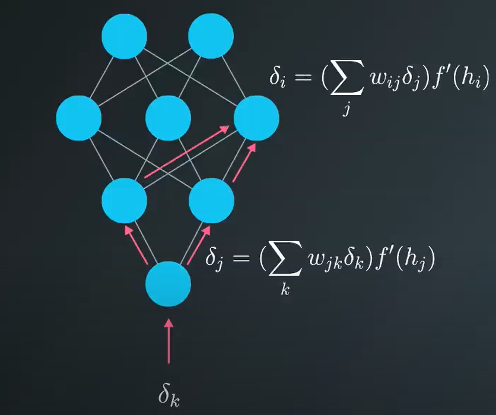
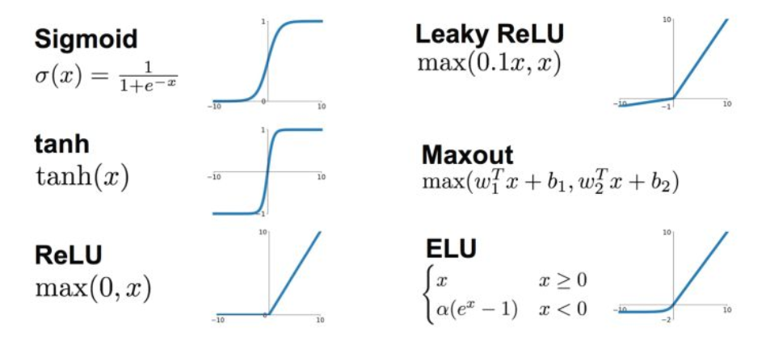
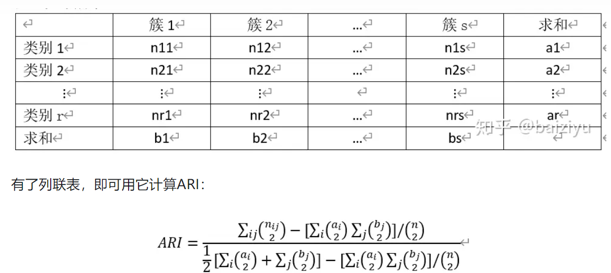
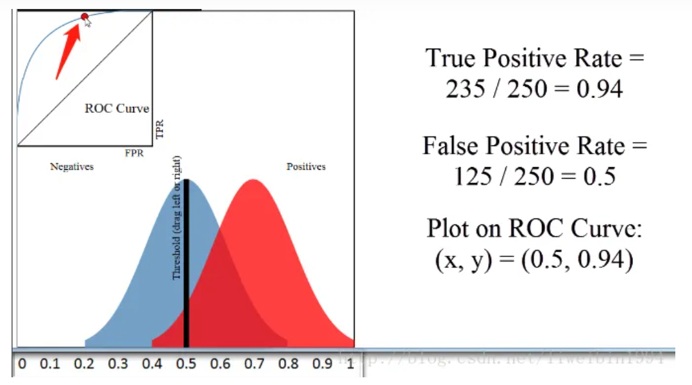
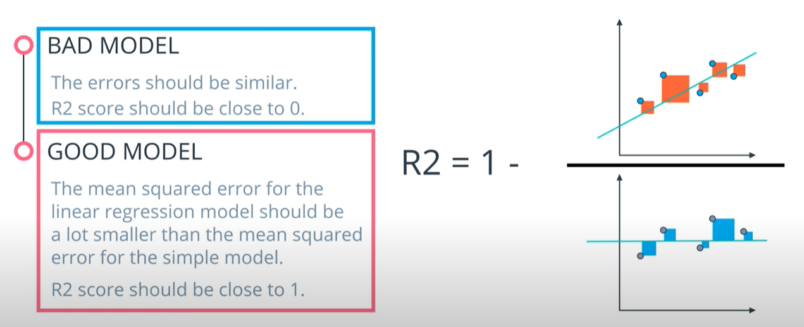

## 非监督学习
分为两类: 聚类和降维

## 常见聚类算法
基于划分（kmeans），基于密度（DBScan），基于网格（Clique），层次聚类，除此之外聚类和其它领域也有很多的结合形成的交叉领域比如半监督聚类，深度聚类，集成聚类等等

## 优化算法
梯度下降法是一阶优化算法，牛顿法是二阶优化算法。牛顿法的收敛速度相比梯度下降法常常较快，但是计算开销大，实际中常用拟牛顿法。牛顿法对初始值有一定要求，在非凸优化问题中（如神经网络训练），牛顿法很容易陷入鞍点（牛顿法步长会越来越小），而梯度下降法则很容易逃离鞍点（因此在神经网络训练中一般使用梯度下降法，高维空间的神经网络中存在大量鞍点）
- 梯度下降法

$\frac{\partial E}{\partial \omega_i} = -(y-\hat{y})f^{'}(h)x_i/m$

$\delta = (y-\hat{y})*f^{'}(h)$

$\triangle{w_i} +=  \delta x_i$

$w_i = w_i + \eta*\triangle{w_i}/m$

η: 学习率; f′(h): 激活函数的导数, m: 数据点个数

反向传播时，上一层节点的损失梯度正比于节点的权重。

  - 批量梯度下降法BGD
  使用所有的训练数据一起进行梯度的更新（梯度下降算法一般用来最小化损失函数）。缺点是计算量比较大。
  - 随机梯度下降法SGD
  每次拿出训练集中的一个数据，进行拟合训练，进行迭代去训练，直到参数比较稳定。优点是迭代速度快，缺点是抖动或收敛到局部最优。目的是降低内存消耗。
  - 小批量梯度下降法MBGD
  每次输入网络训练数据集的一部分，目的是降低内存消耗。
  - 动量梯度下降
  通过引入超参数β，调整权重更新步长。

    $current step = step(n)+β*step(n-1)+β^2*step(n-2)+...$
- 牛顿法
利用迭代点处的一阶导数(梯度)和二阶导数(Hessen矩阵)对目标函数进行二次函数近似，然后把二次模型的极小点作为新的迭代点，并不断重复这一过程，直至求得满足精度的近似极小值。

## 损失函数: 
极大似然估计假设所有采样都是独立同分布的。参数计算时假设样本服从某种概率分布，利用已知样本数据都参数进行估计。
单个样本的预测值与真实值的差称为损失。在回归问题中用残差[y-f(x)]表示，在分类问题中用趋势一致yf(x)表示。
梯度回传通常会占用两倍于前向的memory和compute。

- 回归损失

  - 平方损失：求导方便，能够用梯度下降法优化；对异常值敏感

    $$E = \frac{1}{2m}*\sum_{\mu}\sum_{j}[y_j^\mu-\hat{y}_j^\mu]^2$$
    j: 输出节点数目
    μ: 输入数据个数
  - 绝对损失：异常点多的情况下鲁棒性好；但不方便求导
  - Huber损失：结合了绝对损失函数和平方损失函数的优点；缺点是需要调整超参数
- 分类损失
  - 0-1损失函数：损失不连续，非凸，不宜优化
  - 对数损失函数/对数似然损失函数：与交叉熵损失本质一样
  - Log-Cosh 损失函数：具有Huber的所有优点，同时二阶处处可微（牛顿法要求二阶可微）
  $$L(y,y^p)=\sum_{i=1}^nlog(cosh(y_i^p-yi))$$
  - cross entropy: 概率乘积转化为相加.
    - 二分类
      - 单层网络
        $$
        CE = {-}\frac{1}{m}\sum_{i=1}^{m}(y_i\times \ln{\hat{y_i}}+(1-y_i)\times \ln(1-\hat{y_i}))
        $$
        $$
        \nabla{CE} = -(y-\hat{y})\times(x_1,...,x_n,1)
        $$
        对于含激活函数的分类问题
        $$
        \triangle{w_i} = \alpha*\delta*x_i = \alpha*(y-\hat{y})*f^{'}(\sum(w_i*x_i)) x_i
        $$
      - 多层网络  
        通过chain rule可以计算各层权重的偏微分
    - 多分类
      $$
      CE = {-}\frac{1}{m}\sum_{i=1}^{m}\sum_{j=1}^{n}(y_{ij}\times \ln{\hat{y_{ij}}})
      $$

## 激活函数
梯度消失和梯度爆炸问题都是因为网络太深，网络权值更新不稳定造成的，本质上是因为梯度反向传播中的连乘效应。
梯度消失原因: 隐藏层过多；不合适的激活函数
梯度爆炸原因：隐藏层过多；权重初始值过大（w比较大的情况下，根据反向传播链式相乘，前面的网络层比后面的网络层梯度变化更快，引起了梯度爆炸的问题）
解决方法:使用ReLu激活函数，使用Batch Normalization，预训练加微调

## 拟合
利用cross-validation来绘制learning curve检测模型拟合效果。
- 将所有数据集分成k份
- 不重复地每次取其中一份做测试集，用其他四份做训练集训练模型，之后计算该模型在测试集上的MSE
- 将k次的MSE_i取平均得到最后的MSE

欠拟合解决方法：
- 增加特征
- 提高模型复杂度：神经网络提高神经元数、增加层数；SVM使用核函数；
- 减小正则项的系数

过拟合解决方法：
- 提高样本数量 ：
- 简化模型：
  - 神经网络使用 Dropout、Early Stopping
  - 决策树剪枝、限制树的深度
- 加入正则化项（L1或L2）或提高惩罚系数
- 使用集成学习
- 神经网络中使用dropout机制（dropout会自动将保留层的概率*1/keep_prob，以保证训练和测试期望一致）
- early stopping: 在validation error上升时停止训练
- 标签平滑

## 正则化
正则化本质为限制特征表达项的数量，降低模型复杂度(通过$\lambda$来调整复杂程度, $\lambda$越大惩罚越大)。
多重共线性会造成最小二乘法求解的权值不稳定，正则化可以对权值进行约束。
L1和L2正则，都可以防止过拟合，增强模型的泛化能力；区别在于L1使参数更稀疏，达到特征选取的作用；L2使参数更接近于0。
- L1:求导计算复杂; 可以产生稀疏解; 有特征选择的效果
- L2:求导计算简单;产生非稀疏解; 没有特征选择作用(倾向于平滑均匀的权重)
L1产生稀疏解的原因：L1正则项约束后的解空间是多边形，而L2正则项约束后的解空间是圆形。而多边形的解空间更容易在尖角处与等高线碰撞出稀疏解。
对于存在线性相关的一组特征，L1正则会使得部分参数为0。
L2正则化可以造成权重衰减，避免模型过拟合。（更少的权值代表更低的网络复杂度；拟合函数的导数值小,波动小）

## 超参数
超参搜索算法一般包括的要素（1）目标函数（2）搜索范围，上限和下限（3）其他参数，如搜索步长

- 网格搜索：查找搜索范围内所有的点来确定最优值。简单但是耗时
- 随机搜索：在搜索范围中随机选取样本点
- 贝叶斯优化：对目标函数形状进行学习，找到使目标函数向全局最优值提升的参数。利用pre信息，但是容易陷入局部最优值

## 生成式模型和判别式模型的区别
- 生成方法由数据学习联合概率分布  $P(X,Y)$，然后求出条件概率分布  $P(Y|X)$作为预测模型。如朴素贝叶斯法、隐马尔可夫模型
- 判别方法由数据直接学习决策函数 $f(X)$ 或者条件概率分布 $P(X,Y)$作为预测的模型，关心的是对给定的输入 $X$，应该预测什么样的输出 $Y$。如k近邻、感知机、决策树、逻辑回归、支持向量机、提升方法

## 经验风险和结构风险
- 经验风险是模型对于训练数据的平均损失；
- 结构风险是经验风险加上模型复杂度的正则项

## 参数化模型和非参数化模型
- 参数化模型假设模型参数的维度固定，模型可以由有限维参数完全刻画(如感知机、朴素贝叶斯、逻辑回归、k均值、高斯混合模型)
- 非参数模型假设模型参数的维度不固定或者说无穷大，随着训练数据量的增加而不断增大(决策树、支持向量机、AdaBoost、k近邻)
## 归一化和标准化 (feature scaling)
feature scaling目的是是特征无量纲化(对距离度量和正则化有影响)
概率模型不需要归一化/标准化，因为它们不关心变量的值，而是关心变量的分布和变量之间的条件概率，如决策树、RF。而像Adaboost、GBDT、XGBoost、SVM、LR、KNN、KMeans之类的最优化问题就需要归一化/标准化。

归一化(Normalizing或Min-Max Scaling): $X_{scale} = (X-min(X))/(max(X)-min(X))$

标准化(Standardizing或Z-Scoreing Scaling): $X_{norm} = (X-mean(X)/std(X))$

* 对无监督学习算法使用标准化比归一化更有利。
* 数据中包含曲线，那么标准化是更可取的。
* 数据集具有极高或极低的值（离群值），则标准化是更可取的。
## 数据分析
- 特征变量的分布
  - 特征变量为连续值：如果为长尾分布并且使用线性模型，可以对变量进行对数变换。
  - 特征变量为离散值：对于频次较低的特征，统一编码为“其他”类别。
- 目标变量的分布
  - 目标变量连续：值域范围较大可以考虑对其进行对数变换(Box-Cox)，可以使得模型更好的优化。
    - 1:1 Transformations
      Box-Cox; Yeo-Johnson; Logit Transformation; centring transformation
    - 1:Many Transformations
      由预测单一值转化为预测值域
    - Many:Many Transformations
      - PCA:减少线性相关特征
      - kernel PCA: 考虑变量与因变量之间可能的平方关系

  - 目标变量离散：数据分布不平衡需要上采样/下采样；目标变量在某个ID上面分布不平衡需要分层采样（Stratified Sampling）。
- 分析变量两两之间相关度
清洗高相关和共线性的特征

## 数据清洗
- 缺失值处理
  - 特征值为连续值：偏正态分布，使用均值代替；偏长尾分布，使用中值代替；
  - 特征值为离散值：使用众数代替。
- 文本数据清洗
去除HTML 标签，分词，拼写纠正, 同义词替换，去除停词，抽词干，数字和单位格式统一等

## 类别型数据编码
- 序号编码: 用于类别之间有大小关系的数据
- one-hot编码：用于类别之间不具有大小关系的数据
- 二进制编码：先序号编码，然后将序号二进制化。维度少于one-hot,节省存储空间

## 特征变换
- 特征变换
长尾分布的特征需要进行幂变换或者对数变换。
- 特征编码
  - 对于取值几十万的类别特征（ID特征）：
  - 取频率Top N 的取值进行 One-hot 编码，剩下的类别分到“其他“类目下；
  - 统计量（历史平均点击率，历史平均浏览率）代替该 ID 取值；
  - 将每个类别特征的取值映射到一个连续的向量，得到每个ID的Embedding。参考 entron/entity-embedding-rossmann。
  - 对于 Random Forest 和 GBDT 等模型，使用 LabelEncoder 进行特征编码。

## 模型选择
- 稀疏特征一般使用线性模型(Linear Regression 或 Logistic Regression)。Random Forest 和 GBDT 等树模型和DNN模型不太适用于稀疏特征，可以先对特征通过PCA或SVD/LSA进行降维；
- 稠密型特征使用XGBoost进行建模；
- 数据中既有稀疏特征又有稠密特征，可以使用线性模型对稀疏特征进行建模，将其输出与稠密特征一起再输入 XGBoost/DNN 建模。

## 模型训练
1.	训练验证划分
- 随机划分：采用 KFold 或者 Stratified KFold 的方法来构造训练集和验证集。
- 按时间划分：时序序列数据，譬如取前 7 天数据作为训练集，后 1 天数据作为测试集。
- 按某些规则划分。
2. 参数空间
- DNN或者XGBoost中学习率选 0.01 左右
- Random Forest设定树的棵数范围为 100~200
3.	参数搜索。Grid Search，Random Search， Hyperopt（Hyperopt根据历史评估过的参数组合的效果推测本次评估使用哪个参数组合）

## 组合特征
将一阶特征变为二阶特征，提高特征的非线性表达能力

- 特征相乘
- 特征相除
- 特征分桶
  特征组合后如果维度很高，可以采取数据降维进行特征筛选
## 图像特征提取方法
1）传统方法
- HOG特征
  方向梯度直方图,通过计算和统计图像局部区域的梯度方向直方图来构成特征,结合SVM分类器用于图像识别
- LBP特征
  局部二值模式是一种用来描述图像局部纹理特征的算子,具有旋转不变性和灰度不变性。一般用LBP特征谱的统计直方图作为特征向量用于分类识别
- Haar特征
  分为三类：边缘特征、线性特征、中心特征和对角线特征，组合成特征模板。特征模板内有白色和黑色两种矩形，并定义该模板的特征值为白 色矩形像素和减去黑色矩形像素和。Haar特征值反映了图像的灰度变化情况。
  2）深度学习
## 特征选择
- 过滤式filter
  运用统计指标来为每个特征打分并筛选特征，再用过滤后的特征来训练模型,特征选择过程与后续学习器无关。
  + 移除低方差特征
  + 相关系数排序
  + 假设检验计算相关性
    * 卡方检验
      先假设两个变量确实是独立的（“原假设”）,然后观察实际值（观察值）与理论值（这个理论值是指“如果两者确实独立”的情况下应该有的值）的偏差程度。卡方值越大，P值越小，相关性越强，对Y的解释性越好。特征为连续型，可将其分箱，变成有序的类别型特征，然后和label计算卡方值。
      sklearn-learn中有feature_selection.chi2方法支持大量特征进行卡方检验
    * F检验
      用来判断特征与label的相关性的，F 检验只能表示线性相关关系。
      scikit-learn 中提供了两种F检验方法 —— 适用于分类的 f_classif 和适用于回归的 f_regression ，分别对应单因素方差分析和线性相关分析
  + 互信息（信息增益）
    越大表示两个变量相关性越大。互信息能很好展现 x 和 y 之间的非线性关系。sklearn中normalized_mutual_info_score可以计算互信息。
    
    它不属于度量方式，也没有办法归一化，在不同数据及上的结果无法做比较；对于连续变量的计算通常变量需要先离散化
  + IV值
    用来对输入变量进行编码和预测能力评估，取值范围是【0, 正无穷）。
    单个分组IV值：
    
    整个变量的IV值：
    
- 包裹式wrapper
  从初始特征集合中不断的选择特征子集（如LVM），训练学习器，根据学习器的性能来对子集进行评价，直到选择出最佳的子集。效果好，但是训练开销大
- 嵌入式embedding
  在学习器训练过程中自动地进行特征选择。嵌入式选择最常用的是L1正则化和L2正则化，正则化项越大，模型越简单，系数越小。逻辑回归、线性回归、决策树都可以当作正则化选择特征的基学习器，只有可以得到特征系数或者可以得到特征重要度的算法才可以作为嵌入式选择的基学习器。
## 特征相关性

- 协方差
  只表示线性相关的方向，取值正无穷到负无穷。dataframe.cov()计算所有变量之间的协方差；series.cov(series)计算指定变量之间的协方差
- pearson相关系数
  不仅表示线性相关的方向，还表示线性相关的程度，取值[-1,1]。pearson相关系数为0并不一定表示两个变量之间是独立的，也有可能是非线性相关的。dataframe.corr()计算所有变量之间的相关系数；series.corr(series)计算指定变量之间的协方差
- 距离相关系数
  研究两个变量之间的独立性，距离相关系数为0表示两个变量是独立的。克服了皮尔逊相关系数（Pearson）的弱点。
- MIC最大信息系数
  检测变量之间非线性相关性，值域在 0 和 1 之间
  对于小数据集的MIC计算没有意义，因为误差会非常大。
## 类别不平衡问题
对于类别不平衡问题，常用的有三种方法：

- 基于再缩放策略进行决策，称之为阈值移动 `threshold-moving` 。
- 直接对训练集里的大类样本进行欠采样 `undersampling`。
- 直接对训练集里的小类样本进行过采样 `oversampling`。

1）再缩放
在进行预测的时候，令：

$$
\frac{\overline{p}}{1-\overline{p}}=\frac{p}{1-p} \times \frac{N^{-}}{N^{+}}
$$

然后再将 $\overline{p}$ 跟阈值比较。由于“训练集是真实样本总体的无偏采样”这个假设往往不成立，所以无法基于训练集观测几率来推断出真实几率。
2）欠采样
常用方法是将大类划分成若干个集合供不同学习器使用，这样对每个学习器来看都是欠采样，但是全局来看并不会丢失重要信息。
3）过采样
通常在原始小类之间插值来生成额外的数据。如 `SMOTE`方法：对于每个正类样本 $\overrightarrow{\mathbf{x}}_{i}^{+}$ ，从它的 $k$ 近邻中随机选取一个样本点 $\hat{\mathbf{x}}_{i}^{+}$，然后根据下式生成一个新的正类样本：$\overrightarrow{\mathbf{x}}_{n e w}^{+}=\overrightarrow{\mathbf{x}}_{i}^{+}+\left(\hat{\mathbf{x}}_{i}^{+}-\overrightarrow{\mathbf{x}}_{i}^{+}\right) \times \delta$ ，其中 $\delta \in[0,1]$ 是随机数。

## 前景背景不均衡 
解决方法
* OHEM: 首先计算出每个ROI的loss， 然后按loss从高到低来排列每个 ROI。为了ROI重合冗余，先使用 NMS (non-maximum suppression) 删除部分重合度很高的 ROI。然后为每张图片选择 B/N 个损失最高的 ROI 作为Hard Examples，其中 B 表示总的 ROI 数量， N 表示batch-size 的大小。

  优点：
    - 对于数据的类别不平衡问题不需要采用设置正负样本比例的方式来解决，这种在线选择方式针对性更强；
  	随着数据集的增大，算法的提升更加明显；

  缺点：
    - 只保留loss较高的样本，完全忽略简单的样本，这本质上是改变了训练时的输入分布（仅包含困难样本）。
* Focalloss
Focal loss 通过改变 Cross loss来达到区分easy/hard的目的:
当 pt 非常小时，即样本被分类错误，此时 (1−pt)γ 接近1， loss几乎不受影响，当 pt 接近于1时，即样本被分类正确，此时 (1−pt)γ 接近0，此时降低了该样本的权重

  优点:
    - FocalLoss则是对正负样本进行加权，使得全部的样本可以得到学习，容易分类的负样本赋予低权值，hard examples赋予高权值

  缺点:
    - 在所有的anchor examples中，出了大量的易分类的负样本外，还存在很多的outlier，FocalLoss对这些outlier并没有相关策略处理。
    - FocalLoss存在两个超参，根据不同的数据集，调试两个超参需要大量的实验，一旦确定参数无法改变，不能根据数据的分布动态的调整
* 前景过采样: 增加样本数少的样本的采样方法

## 熵
熵（entropy）是表示随机变量不确定性的度量，是整个系统的平均信息量。
$$ 
H(X) = -\sum_{i=1}^{n} p_i {\rm log } \ p_i 
$$
**自信息量**是用来描述某一条信息的大小

$$
I = - {\rm log} \ p_i
$$

通常以2为底，单位是bit；含义是用多少位二进制可以表示衡量该信息的大小。
  - 联合熵
  多维随机变量的熵
  - 条件熵
  $H(Y|X)$ 表示在已知随机变量X的条件下随机变量Y的不确定性。是指在给定某个数（某个变量为某个值）的情况下，另一个变量的熵是多少
  - 信息增益
  数据集D的经验熵 $H(D)$ 与特征A给定条件下D的经验条件熵 $H(D|A)$ 的差
  - 信息增益比
  因为信息增益对取值数目多的属性有所偏好，为了减少这种偏好带来的影响，使用信息增益比来选择最优划分属性。
  在信息增益的基础之上乘上一个惩罚参数。特征取值较多时，惩罚参数较小；特征取值较少时，惩罚参数较大。
  惩罚参数：数据集D以特征A作为随机变量的熵的倒数，即：将特征A取值相同的样本划分到同一个子集中（之前所说数据集的熵是依据类别进行划分的）。
  - 基尼系数
  表示在样本集合中一个随机选中的样本被分错的概率。基尼指数（基尼不纯度）= 样本被选中的概率 * 样本被分错的概率。CART在每一次迭代中选择划分后**基尼指数最小**的特征及其对应的切分点进行分类

  - 交叉熵
  刻画两个概率分布之间的距离，通过q来表示p的交叉熵为；一般p(x)为真实分布，q(x)为预测分布。
  交叉熵不对称。交叉熵越小，概率分布越接近。相比于MSE，它的学习收敛速度更快。

$$
H(p,q) = - \sum\limits_{x} p(x) {\rm log } \ q(x)
$$
- KL散度/相对熵
使用KL散度来评估predict和label之间的差别,与交叉熵等效

## 聚类评价指标
聚类一般要求高的类内相似度(compactness)和低的类间相似度（separability）。

### 外部指数:
使用外部标签进行评价

- 纯度（purity）

把每个簇中最多的类作为这个簇所代表的类，计算正确分配的类的数量占总样本数的比例，范围为[0,1]。
优点：方便计算
缺点：聚类数量衡量聚类质量在一些场景不太适用
- 兰德系数（RI）

样本中的所有的pair中聚类算法和真实标签一致的比例，取值范围为[0，1]，越大表示聚类效果越好
$$RI = \frac{a+b}{C_n^2}$$
a: 同类的样本对同时在真实标签和聚类结果中的个数
b: 不同类的样本对同时在真实标签和聚类结果中的个数

可以通过混淆矩阵简化计算:
  - TP：同类样本对在同一个簇中的数量；
  - FP：非同类样本对在同一个簇中的数量；
  - TN：非同类样本对分别在两个簇中的数量；
  - FN：同类样本对分别在两个簇中的数量；

$RI = Accuracy = \frac{TP+TN}{TP+FP+FN+TN}$ 

- 调整兰德系数（ARI）

兰德系数无法保障随机划分的RI值接近0,区分度比较低，因此需要调整兰德系数。取值范围为[-1,1]，值越大聚类效果越好，随即划分的ARI值为0。
$$ARI = \frac{RI-E[RI]}{max(RI)-E[RI]}$$

- Fawlks and Mallows（FMI）

范围为[0,1]
- NMI measure

范围为[0,1]
- jaccard

范围为[0,1]
- F值

范围为[0,1]

### 内部指数
没有标签，使用聚类结果内部特征进行评价。

- 轮廓系数(Sihouette Index)

衡量的是每个样本点到其簇内样本的距离与其最近簇结构之间距离的关系，适用于评价紧凑类圆状的聚类(对DBSCAN和环状聚类评估效果差，不要使用轮廓系数)。可以用于寻找聚类簇数K，或比较不同算法聚类效果。

样本点i的轮廓系数$$s(i)=\frac{b(i)-a(i)}{max(a(i),b(i))}$$
a(i): 样本点到簇中每个样本距离的均值
b(i): 样本点到最近簇中每个样本距离的均值

聚类结果的轮廓系数$$s = \frac{1}{n}\sum_{i=1}^ns(i)$$
取值范围为[-1, 1]，值越大代表样本点所在的簇结构与其最近簇结构之间的距离越远，聚类结果越好。

- Calinski-Harabasz 

- Bayes Information Criterion（BIC）

- Dunn Index

### 相对指数
比较两个聚类结果好坏。

## 有监督学习评估指标
### 分类
1）Fbeta
$$F_\beta = (1+\beta^2)*\frac{precision*recall}{(\beta^2*precision)+recall}$$

beta用于定义召回率和精确率的相对重要性(区分评价high recall模型[实际空间里正确的比例比例]和high precision模型[预测空间里正确比例重要])，beta越大，则recall越重要，当beta趋于无穷大时，Fbeta=recall，越小，则precision越重要，当beta**2趋于0时，Fbeta=precision。

2）ks曲线

ks曲线的横坐标是分类的阈值，纵坐标代表了精确率或者误杀率，一个分类阈值对应的一个精确率和一个误杀率，而ks曲线就是用每个分类阈值下的精确率-误杀率，ks值则是指ks曲线上的最大值

3）F1 score

F1值是精确率和召回率的调和均值，可泛化为对精确率和召回率赋不同权值进行加权调和(harmonic mean)。

$F1 = \frac{2*recall*precision}{recall+precision}$

4）PR曲线

$precision = \frac{TP}{TP+FP}$

$Recall = \frac{TP}{TP+FN}$

根据置信度从大到小排序所有的预测框，计算累加的 Precision 和 Recall 的值, 绘制PR曲线，precision取右侧最大值做平滑处理。

计算 AP，一般使用的是插值的方法，取 11 个点 [0, 0.1, 0.2, 0.3, 0.4, 0.5, 0.6, 0.7, 0.8, 0.9, 1] 的插值所得
$$AP=\frac{1}{11}*\sum{precision} $$

5）ROC曲线

ROC曲线是用来衡量分类器的分类能力，表示随机抽取一个正样本和一个负样本，分类器正确给出正样本的score高于负样本的概率。

$TPR = \frac{TP}{TP+FN}$

$FPR = \frac{FP}{FP+TN}$
* 通过动态调整截断点，从最高置信度开始(对应ROC曲线零点)逐渐调整到最低得分，每个截断点对应一个FPR和TPR，在ROC图上绘制每个截断点的位置，连接所有点得到最终的ROC曲线。
* 根据样本标签统计正负样本数量(正样本数量为P，负样本数量为N)。把横轴刻度设置为1/N, 纵轴刻度设置为1/P，根据模型输出的预测概率对样本从高到低进行排序。依次遍历样本，从零点开始绘制POC曲线，每遇到一个正样本就沿纵轴绘制一个刻度间隔的曲线，每遇到一个负样本就沿横轴绘制一个刻度间隔的曲线，直到遍历完所有样本，曲线到达(1，1)。

6）AUC

AUC(Area under Curve)：Roc曲线下的面积，介于0.5和1之间。Auc作为数值可以直观的评价分类器的好坏，值越大越好。(AUC是随机抽出一对样本，把正样本预测为1的概率大于把负样本预测为1的概率的概率)
AUC的计算方法同时考虑了分类器对于正例和负例的分类能力，在样本不平衡的情况下，依然能够对分类器作出合理的评价。
计算方法:
* 对所有样本按照预测值从小到大标记rank(index+1)。将所有正样本的rank相加，遇到预测值相等的情况，不管样本的正负性，对rank要取平均值再相加。将rank相加的和减去一个常数项，再除以总的组合数，得到auc。
$$AUC=\frac{\sum_{positiveclass}{rank}-\frac{M*(M+1)}{2}}{M*N}$$
rank表示第i个样本的序号，M，N分别表示正负样本个数
* 在有M个正样本N个负样本的数据集里。一共有M*N对样本（A，B），若P(A)>P(B)记为1，若P(A)<P(B)记为0，若P(A)=P(B)记为0.5。求和后除以总的组合数得到AUC。
$$Auc=\frac{\sum{score(P_{pos},P_{neg})}}{M*N}$$ 

| case  | score |
| -------- | ------------| 
| $$P_{pos}>P_{neg}$$ | 1 |
| $$P_{pos}<P_{neg}$$ | 0 | 
| $$P_{pos}=P_{neg}$$ |0.5| 

GAUC
用户推荐是一个个性化的场景，不同用户之间的商品排序不好放在一起比较，需要使用GAUC进行评价，
$$GAUC=\frac{\sum_{ui}{w_{ui}*AUC}}{\sum{w_{ui}}}$$

### 回归
1) MSE
2) MAE
3) R2 Score

