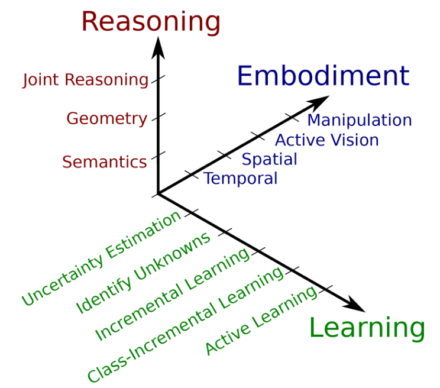
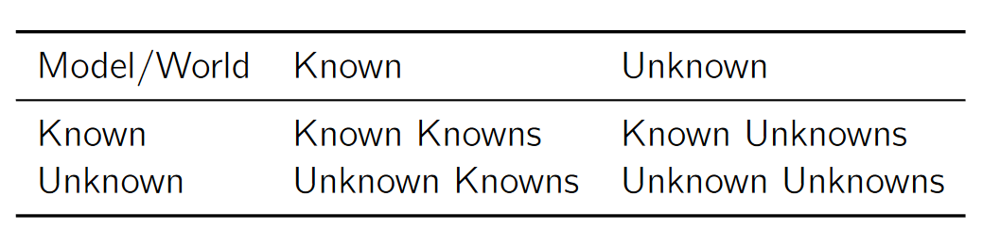

## 相关性
- 信息量：某个事件出现概率的倒数的对数(概率越低，信息量越大)
- 熵：一个系统所有变量信息量的期望(系统不确定性越高，熵越高)
- 联合熵：多个联合变量的熵
- 条件熵：给定一个变量的条件下，系统的熵
- 相对熵：又称为KL散度，表示两个分布对同一变量的差异（作用：用近似且简单的分布代替复杂的分布，减少需要编码的数量，或者作为目标方程来优化模型，用来衡量两个取值为正的函数分布之间的差异）。散度不满足对称性。

- 交叉熵(cross entropy)：与相对熵等价，优化KL散度，用来衡量分布差异性(机器学习计算常用,用非真实分布估计真实分布，交叉熵越低，由算法所产生的策略最接近最优策略)。

- 信息增益：衡量一个变量对系统的影响，通过样本获得。信息增益 = 熵 - 条件熵

- 互信息：同一个系统下两个子系统的交叉部分的信息量，通过总体获得。
$$ I(X,Y)=H(X)-H(X|Y) = H(Y)-H(Y|X) = H(X) + H(Y) -H(X,Y) $$

## 分布
### 二项分布
在只有两个结果的n次独立的伯努利试验中，所期望的结果出现次数的概率

## 矩阵
### 协方差矩阵
描述多维变量相关关系的矩阵（若两个变量相互独立，则协方差为零）。变量相关度越大，非对角线元素越大，不确定度越小。协方差矩阵的逆矩阵是马氏距离的权重，它考虑了特征之间的相关性，使得马氏距离可以度量样本之间的相似性。

## 不确定性

预测的不确定性可以分为三部分

- 数据不确定性AU(随机噪音产生的不确定性Aleatoric): 不能通过增加信息来降低不确定性
    - 同方差噪声: 分布方差不变
    - 异方差噪声: 分布方差随输入变化而变化

- 模型不确定性MU(模型参数估计的不确定性Epistemic, 比如模型不合理，数据不平衡): 可以通过增加训练数据降低不确定性
- 输出分布的不确定性DU

不确定性可以通过概率分布模型来表征，当不确定性过高时可以直接拒绝输出结果。
- 回归模型可以通过均值和方差组成的3σ区间来表示
- 分类模型可以通过softmax或sigmoid输出表示

熵值可以表示系统的不确定度。分类模型均匀分布的熵值最大，具有确定均值和方差的回归模型高斯分布的熵值最大。

### 不确定性估计 
#### 直接估计(DUQ)
机器学习最小化对数损失函数(负对数似然NLL)等效于最大似然估计(给定一组数据和一个模型，选择那些使得观察到这组数据的可能性（即"似然"，数据的联合概率密度函数）最大的参数)。高斯NLL表示当数据服从高斯分布时在当前参数条件下的分布概率，通过学习AU来降低损失函数。
机器学习模型直接输出均值和方差作为对不确定性的估计，多模型则通过GMM进行不确定性估计。

#### 贝叶斯网络估计
通过已知网络权重下数据分布来估计已知数据下模型权重的分布。
$$P(w|D) = \frac{P(D|w)P(w)}{P(D)}$$ 
D = {x_i, y_i}：训练数据；
P(w)：随机初始权重概率分布；
P(D|w): 前向传播数据分布；
P(w|D):模型学习权重的分布；

贝叶斯预测后验
$$P(y|x) = \int_{w}{P(y|w,x)P(w|D)dw}$$
对新数据的预测是基于所有可能的参数值的预测(前向传播)的加权平均，其中权重是参数的后验概率(后验权重)。这个积分通常无法直接计算，需要使用数值方法（如蒙特卡罗采样）来近似。
$$p(y|x) \propto M^{-1}\sum_{i}^M{p(y|x,\theta_i)}$$
M：M次前向传播；$\theta$：权重

#### 基于采样
通过在预测阶段开启dropout来模拟蒙特卡洛采样，可以实现对预测后验分布的有效估计。DropConnect 是 Dropout 的一种变体，它不是丢弃神经元，而是丢弃权重

#### 变分推理
是一种在贝叶斯统计和机器学习中常用的技术，用于估计复杂模型的后验分布。它的基本思想是将复杂的后验分布近似为一个简单的分布（如高斯分布），然后通过优化这个简单分布的参数来使其尽可能接近真实的后验分布。
不确定性估计的过程也就是模型训练的过程，通常使用KL散度作为距离度量。
$$KL(q,p)=\int_x{q(x)log{\frac{q(x)}{p(x)}}}$$
- KL(q,p)>=0总成立
- KL(q,p)=0当且仅当q=p时成立

Evidence Lower BOund(ELBO)是对模型证据（也称为边缘似然性）的**下界**，最大化ELBO相当于最大化模型证据的下界，这是变分推理的主要目标。
$$ELBO = E[log P(D|w)]-KL(q(w)||p(w))$$
$E[-log P(D|w)]$: 模型的负对数似然估计，通过蒙特卡洛采样进行估计；
$KL(q(w)||p(w))$：后验权重分布与先验权重的差异

缺点：
- 只能估计损失的下界
- 估计质量受多因素影响（权重分布，网络结构，采样数量）
- 必须在网络结构中加入特定的权重分布层

变分推理的实现：贝叶斯后向传播，Flipout
#### 模型分解学习
1）回归模型
通过GMM可以将不确定性进行分解：
$$\sigma_*^2(x) = M^{-1}\sum{\sigma_i^2(x)} +M^{-1}\sum{\mu_i^2(x)}-\mu_*^2(x)$$
$$=E_i[\sigma_i^2(x)] + E_i[\mu_i^2(x)] - E_i[\mu_i(x)]^2$$
$$=E_i[\sigma_i^2(x)] + Var_i[\mu_i(x)]$$
前一项样本方差的期望表示AU，可理解为将所有的方差表示为一个方差；后一项样本均值的方差表示EU，可理解为不同高斯模型估计的差异。

2）分类模型
通过分类模型预测的logits(符合高斯分布的logits)可以计算得到AU和EU的不确定性logits：
$$\sigma_{Ale}^2(x) = E_i[\sigma_i^2(x)]$$
$$\sigma_{Epi}^2(x) = Var[\mu_i(x)]$$
经过softmax得到分布概率：
$$P_{Ale}(y|x) = sampling\_softmax(\mu(x), \sigma_{Ale}^2(x))$$
$$P_{Epi}(y|x) = sampling\_softmax(\mu(x), \sigma_{Epi}^2(x))$$
计算熵值：
$$P_{Ale}(y|x) = entropy(P_{Ale}(y|x))$$
$$P_{Epi}(y|x) = entropy(P_{Epi}(y|x))$$

### 评估与标定
目标:模型预测准确率应当正比于模型的不确定性。
正确的KPI指标应该保证只有在预测了正确的分布情况下值才最大。

1）分类评估指标
- 对数损失
- 熵：表征信息量的大小
- 交叉熵：NLL的特例，适用于分类任务
- KL 散度：损失函数的通用方法，通过距离度量不确定度
- brier score：输出概率和真实分布概率的均方差
$$Brier(y, \hat{y}) = N^{-1}\sum{(y_i-\hat{y_i})^2}$$
- 高斯负对数似然损失：NLL的特例，适用于高斯分布回归任务，通过方差来估计不确定性

2）回归评估指标
- 区间覆盖率
- 微分熵：高斯熵只依赖于高斯分布的方差

评估指标分解
$$E[d(S, Y)] = E[d(S, C)] + E[d(C, Y)]$$
第一项表示预测的评估得分期望，第二项表示标定损失的期望，可以代表EU，第三项表示优化损失(refinement loss, sharpness)的期望，可以代表AU(AU上升不利于得到高可信的预测)。
Y: 真实值概率，S：预测值概率，C：标定后概率。
d: 表示评估分数差异(对交叉熵损失，d为KL散度；对Brier，d为mse)

#### 分类标定指标
分桶数应当最小和ECE，或者使标定曲线更加平滑。

1）Reliability Plot
- 将预测结果按照可信度分桶
- 计算每个桶内的准确率
- 画直方图

2）标定误差
标定误差
$$CE = \sum_i{|acc(B_i)-conf(B_i)|}$$
预期标定误差（更稳定且不容易受outlier影响）
$$ECE = \sum_i{N^{-1}|B_i||acc(B_i)-conf(B_i)|}$$
最大标定误差
$$MCE = \max_i{|acc(B_i)-conf(B_i)|}$$

3）Error vs Confidence Plot
- 分类误差: loss, accuracy, error, brier score
- 回归误差：mse, mae, $R^2$ score

#### 回归标定指标
- 定义可信度桶分区
- 定义每个分桶的均值和方差
- 计算并统计覆盖率
- 绘制折线图

#### 分类标定
$$P(y_{\alpha}|x) = |\hat{y_{\alpha}}|^{-1}\sum_{i\in\hat{y_\alpha}}1[\hat{y_i}=y_i]$$
表示y在可信区间范围α上的实际分布概率应该等于预测正确的比例。

标定方法（从上到下逐渐严格）
- confidence calibration: 用最大预测概率的类进行标定
- classwise calibration: 每一个类都被单独标定.
- multi-class calibraion: 所有类被联合标定

#### 回归标定
$$P(l_\alpha <= y <=u_\alpha) = \alpha$$
$$|\hat{y_\alpha}|^{-1}\sum_{i\in\hat{y_\alpha}}1[\hat{y}_{\alpha,i}^l <= y <=\hat{y}_{\alpha,i}^h] = \alpha$$
表示在特定可信区间内实际分布概率等于预测的分布概率。

标定方法
- 分位数回归:

对于$\tau \in [0,1]$
$$P(Y <= g(x, \tau)) = \tau$$ 
g:分位数函数(累计分布函数的逆)

#### 具体标定实现

1) Post-Hoc：直接修改预测概率

- 标定图：通过函数g将预测结果映射到标定空间概率
    - 普拉特缩放(Platt Scaling)
    $$g(x) = \frac{1}{1+exp(Ax+B)}$$
    A,B通过梯度下降和二分类交叉熵损失学习得到

    - 经验分箱(Empirical Binning)
    $$g(x) = acc(B_i)$$
    if $x \in B_i$

    - 等渗校准(Isotonic Calibration)：
    类似于经验分箱，但是 $B_i = [l_i, u_i]$也作为学习参数，而不是使用固定值。同时桶大小也不一定相等。

    - 温度缩放(Temperature Scaling)
    $$softmax(x) = [\frac{exp(x_i/T)}{\sum_jexp({x_j/T})}]_i, i\in[0, C-1]$$
    T可以平衡类别不平衡，软化输出分布，从而使概率分布得到优化。

2) A Priori：修改模型结构或者训练方式得到更好的模型

- 混合训练(Mixup Training)
通过数据增广优化预测可信度。

### OOD
所有机器学习模型的隐含假设是训练和测试数据同分布（闭集假设: 只考虑known known）。目前基于不确定性的OOD检测并不稳定。

异常类型
- 异常检测(Anomaly Detection)：找出那些不符合预期模式或显著偏离正常行为的数据点
- 新类检测(Novelty Detection): 关注的是新的或未知的模式
- 开放集识别(Open Set Recognition: OSR):不仅需要识别已知类别的数据，还需要能够处理未知类别的数据
- 离群点检测(Outlier Detection): 找出那些显著偏离其他观测值的数据点
- OOD检测：识别与训练数据分布不同的数据,需要精确的EU不确定性。

OOD产生原因
- Covariate/Feature Shift: 特征分布发生变化，但类别标签不变
- Label Shift：特征分布不变，但类别标签发生变化
- concept shift：标签代表的含义发生变化

OOD评价指标
- Precision and Recall.
- False Positive Ratio and True Positive Ratio.
- ROC Curves and AUC.

OOD检测步骤：分类模型采用熵值，回归模型采用方差或标准差判断

1) 判别式模型检测

- EU(分类采用熵值，回归采用mse)作为检测指标
- 额外检测头输出ID或OOD分数
- 训练模型最大化ID和OOD分数差异

2) 生成式模型检测
对数据分布密度建模，对ID生成低分数，OOD生成高分数，通过似然概率比率(LLR)优化检测结果。
