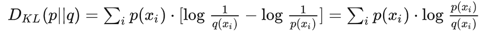
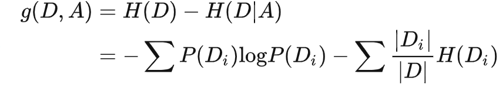

## 相关性
- 信息量：某个事件出现概率的倒数的对数(概率越低，信息量越大)
- 熵：一个系统所有变量信息量的期望(系统不确定性越高，熵越高)
- 联合熵：多个联合变量的熵
- 条件熵：给定一个变量的条件下，系统的熵
- 相对熵：又称为KL散度，表示两个分布对同一变量的差异（作用：用近似且简单的分布代替复杂的分布，减少需要编码的数量，或者作为目标方程来优化模型）。散度不满足对称性。

- 交叉熵：与相对熵等价，用来衡量分布差异性(机器学习计算常用)。

- 信息增益：衡量一个变量对系统的影响，通过样本获得

- 互信息：同一个系统下两个子系统的对应部分的信息量，通过总体获得

## 分布
### 二项分布
在只有两个结果的n次独立的伯努利试验中，所期望的结果出现次数的概率

## 矩阵
### 协方差矩阵
描述多维变量相关关系的矩阵（若两个变量相互独立，则协方差为零）。变量相关度越大，非对角线元素越大，不确定度越小。可以用于计算马氏距离的权重。